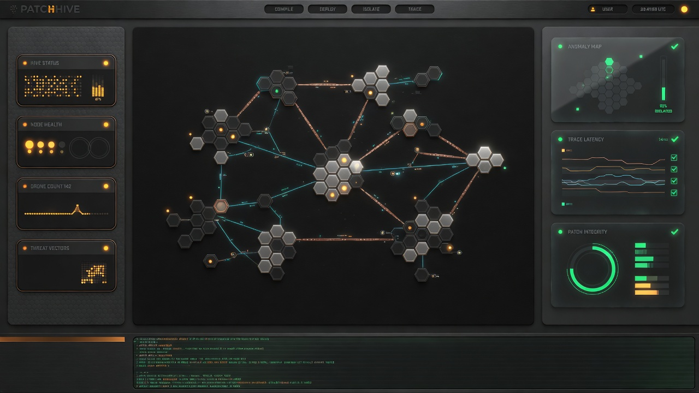

# PatchHive

<p align="center">
  
</p>

<p align="center">
  <a href="https://github.com/scrimshawlife-ctrl/Patch-Hive/actions/workflows/backend-tests.yml"></a>
  <a href="https://github.com/scrimshawlife-ctrl/Patch-Hive/actions/workflows/code-quality.yml"></a>
  <a href="https://github.com/scrimshawlife-ctrl/Patch-Hive/actions/workflows/security.yml"></a>
  <a href="https://github.com/scrimshawlife-ctrl/Patch-Hive/actions/workflows/engineering-quality.yml"></a>
  <a href="docs/PRODUCTION_READINESS.md"></a>
  <a href="docs/FEATURE_FLAGS.md"></a>
  <a href="docs/ROADMAP.md"></a>
  <a href="LICENSE"></a>
</p>

<p align="center">
  
</p>

**PatchHive** is a deterministic Eurorack **rig-intelligence and patch-book publishing system**. It converts a verified modular rig into immutable, explainable patch libraries and publication-ready exports — without synthesizing audio or controlling hardware.

> **Canonical publishing invariant:** every published patch is complete, executable, and understandable on exactly one standalone page.

A [Zero State](brand/zero-state/) product · brand kit in [`brand/`](brand/README.md)

---

## Status (2026-07-21)

| Item | Value |
|------|--------|
| **Release line** | `v0.3.0-alpha` (late alpha — **not** production) |
| **Canon MVP** | On `main` — credits/exports via `/api/canon/*` |
| **Design Engine** | On `main` — flags **default off** ([staging enablement](docs/design/PATCHBOOK_STAGING_ENABLEMENT.md)) |
| **VSI P0** | Photo evidence + inventory gate + multi-photo fusion (mock vision) |
| **UI** | Cyber Hive / Zero State tokens ([#95](https://github.com/scrimshawlife-ctrl/Patch-Hive/pull/95) Login; [#96](https://github.com/scrimshawlife-ctrl/Patch-Hive/pull/96) pages) |
| **Production deploy** | **Not performed** |
| **Live payments** | **Disabled** (`ALLOW_PRODUCTION_PAYMENTS=false`) |
| **Readiness** | [Assessment](docs/evidence/PRODUCTION_READINESS_ASSESSMENT_2026-07-21.md) · [Matrix](docs/evidence/PRODUCTION_READINESS_MATRIX.md) |
| **Next work** | [Roadmap](docs/ROADMAP.md) · [Continuation](docs/CONTINUATION.md) · [Current state](CURRENT_STATE.md) |

### Product surface (preview)

| Workspace concept | Empty / loading language |
|-------------------|---------------------------|
|  |  |

---

## Product contract

PatchHive enables a user to:

1. Build or import a rig through manual, photo-assisted, or hybrid ingestion.
2. Confirm uncertain module matches and preserve missing technical data as missing.
3. Create an immutable rig revision.
4. Generate an immutable run containing exactly one patch library.
5. Explore validated patches for free.
6. Compile each patch into one deterministic page (Design Engine styles presentation only).
7. Export PDF, SVG, JSON, or ZIP artifacts through an idempotent credit boundary.
8. Revisit earlier runs without mutating their generated artifacts.

PatchHive is a compiler and publishing system — not a preset marketplace, audio simulator, DSP engine, or hardware-control surface.

## Current posture

| Area | Status |
|---|---|
| Canonical MVP | Implemented on `main` |
| PatchBook Design Engine | Implemented; **feature-flagged off** by default |
| Visual System Intelligence P0 | Implemented (mock/fixture vision) |
| Release line | `0.3.x` alpha |
| Production readiness | **Not ready** — see [readiness assessment](docs/evidence/PRODUCTION_READINESS_ASSESSMENT_2026-07-21.md) |
| Production payments | Disabled |
| Production deployment | Not performed |
| Hardware activation | Explicitly out of scope |

For exact commit and ops posture: [CURRENT_STATE.md](CURRENT_STATE.md).  
For ordered work: [docs/CONTINUATION.md](docs/CONTINUATION.md).  
For capability sequence: [docs/ROADMAP.md](docs/ROADMAP.md).

## Release governance

- `0.1.x` — historical prototype  
- `0.2.x` — canon-aligned MVP (**complete** on main; not GA)  
- `0.3.x` — Patch Books + Design Engine + VSI (**active alpha**)  
- `0.4.x` — production hardening  
- `1.0.0` — first production-supported release (after all gates + operator authority)

See [docs/VERSIONING.md](docs/VERSIONING.md), [docs/ROADMAP.md](docs/ROADMAP.md), [docs/PRODUCTION_READINESS.md](docs/PRODUCTION_READINESS.md), [CHANGELOG.md](CHANGELOG.md).

## One-page Patch Book Generator

```text
CanonicalRig
  -> PatchGraph + PatchPlan + ValidationReport
  -> PatchPageSpec
  -> PageFitReport
  -> deterministic SVG page assets
  -> PatchBookManifest
  -> PDF / SVG / JSON / ZIP export
```

**Non-negotiable:** one patch per page; no inventing inventory; fail closed on overflow; SVG technical source; color supplemental to labels/patterns.  
Full contract: [docs/PATCH_BOOK_GENERATOR.md](docs/PATCH_BOOK_GENERATOR.md) · Design Engine: [docs/design/PATCHBOOK_DESIGN_ENGINE.md](docs/design/PATCHBOOK_DESIGN_ENGINE.md).

## Canonical model

```text
User
  -> Rig
    -> immutable RigRevision
      -> immutable Run
        -> exactly one PatchLibrary
          -> immutable Patches
            -> exactly one PatchPageSpec per published patch
```

Favorites, notes, and completion state are mutable overlays that never alter canonical patch content.

## Architecture

| Layer | Choice |
|-------|--------|
| Frontend | React, TypeScript, Vite |
| Backend | FastAPI modular monolith |
| Canonical domain | `backend/canon` |
| Persistence | PostgreSQL (SQLite unit-test adapter only) |
| Migrations | Alembic |
| Brand | Zero State × Cyber Hive — [`brand/`](brand/README.md) |

Provider-assisted vision is **untrusted evidence**. Normalization, generation, validation, page compilation, hashing, and manifests are deterministic for fixed normalized input + versions + seed.

## Repository map

```text
backend/canon/           canonical contracts, compiler, exports, design recipes
backend/evidence/        photo evidence, vision adapters (fail-closed)
frontend/                product UI (Cyber Hive tokens)
brand/                   logos, marketing stills, icon set, design-system preview
docs/                    architecture, readiness, roadmap, design engine
docs/evidence/           SHA-pinned receipts and readiness matrix
schemas/                 versioned JSON schemas
docker-compose.staging.yml   fail-closed staging-like stack
```

## Quick start

### Prerequisites

- Python 3.11 or 3.12 · Node.js 22 · npm 10+ · PostgreSQL 15 · Docker optional

### Backend

```bash
git clone https://github.com/scrimshawlife-ctrl/Patch-Hive.git
cd Patch-Hive
python3 -m venv .venv
source .venv/bin/activate
cd backend
python -m pip install -e '.[dev]'
alembic upgrade head
uvicorn main:app --reload
```

### Frontend

```bash
cd frontend
npm ci
npm run dev
```

Copy [`.env.example`](.env.example) to `.env`. **Never** enable production payments without an explicit release decision.

### Staging-like Compose (local)

```bash
export STAGING_SECRET_KEY="$(openssl rand -base64 32)"
docker compose -f docker-compose.staging.yml up -d --build
curl -sf http://localhost:8000/health
```

Design Engine flags: [docs/design/PATCHBOOK_STAGING_ENABLEMENT.md](docs/design/PATCHBOOK_STAGING_ENABLEMENT.md).  
Domain cutover (operator-owned): [docs/evidence/DOMAIN_CUTOVER_CHECKLIST.md](docs/evidence/DOMAIN_CUTOVER_CHECKLIST.md).

## Validation

```bash
cd backend
python -m pytest tests --ignore=tests/acceptance -q
alembic heads

cd ../frontend
npm ci
npm run lint && npm run type-check
npm test -- --run
npm run build
```

CI is authoritative only for the exact commit it evaluates. Missing Postgres is `NOT_COMPUTABLE`, not a pass.

| Gate | Posture |
|------|---------|
| Backend / Quality / Security CI | Required green on merge |
| Production readiness gates | [docs/PRODUCTION_READINESS.md](docs/PRODUCTION_READINESS.md) |
| Latest assessment | [docs/evidence/PRODUCTION_READINESS_ASSESSMENT_2026-07-21.md](docs/evidence/PRODUCTION_READINESS_ASSESSMENT_2026-07-21.md) |

## Brand assets

| Asset | Path |
|-------|------|
| GitHub / social banner | [`brand/marketing/github-banner.jpg`](brand/marketing/github-banner.jpg) |
| Splash hero | [`brand/splash/splash-hero.jpg`](brand/splash/splash-hero.jpg) |
| Dashboard concept | [`brand/marketing/dashboard-concept.jpg`](brand/marketing/dashboard-concept.jpg) |
| Empty state | [`brand/marketing/empty-state.jpg`](brand/marketing/empty-state.jpg) |
| Wordmark lockup | [`brand/patchhive/lockups/horizontal-from-zero-state.svg`](brand/patchhive/lockups/horizontal-from-zero-state.svg) |
| Cyber bee mark | [`brand/patchhive/logo/cyber-bee-mark.jpg`](brand/patchhive/logo/cyber-bee-mark.jpg) |
| Icon set (SVG) | [`brand/icons/svg/`](brand/icons/svg/) |
| Design system preview | [`brand/design-system/index.html`](brand/design-system/index.html) |
| Guidelines | [`docs/brand/BRAND_GUIDELINES.md`](docs/brand/BRAND_GUIDELINES.md) |

## Documentation authority

| Document | Responsibility |
|---|---|
| [CURRENT_STATE.md](CURRENT_STATE.md) | Live repository posture |
| [docs/ROADMAP.md](docs/ROADMAP.md) | Versioned capability roadmap |
| [docs/PRODUCTION_READINESS.md](docs/PRODUCTION_READINESS.md) | RC / GA gate framework |
| [docs/evidence/PRODUCTION_READINESS_ASSESSMENT_2026-07-21.md](docs/evidence/PRODUCTION_READINESS_ASSESSMENT_2026-07-21.md) | Dated readiness narrative + continuity plan |
| [docs/evidence/PRODUCTION_READINESS_MATRIX.md](docs/evidence/PRODUCTION_READINESS_MATRIX.md) | SHA-pinned area scores |
| [docs/CONTINUATION.md](docs/CONTINUATION.md) | Ordered engineering backlog |
| [docs/FEATURE_FLAGS.md](docs/FEATURE_FLAGS.md) | Fail-closed defaults |
| [docs/OPERATIONS.md](docs/OPERATIONS.md) | Release and recovery gates |
| [docs/SECURITY.md](docs/SECURITY.md) | Trust boundaries |
| [docs/PATCH_BOOK_GENERATOR.md](docs/PATCH_BOOK_GENERATOR.md) | One-page publishing contract |
| [docs/design/PATCHBOOK_DESIGN_ENGINE.md](docs/design/PATCHBOOK_DESIGN_ENGINE.md) | Design Engine contracts |
| [CHANGELOG.md](CHANGELOG.md) | Notable changes |

## Safety and scope

PatchHive produces symbolic and technical documentation, not electrical certification. Unknown voltage, current, power, impedance, mode, or port behavior stays unknown until confirmed.

Community feeds, public profiles, comments, leaderboards, audio simulation, MIDI/CV activation, and hardware control remain outside the canonical MVP.

## Contributing

See [docs/engineering/Contributing.md](docs/engineering/Contributing.md) and [docs/engineering/DevelopmentWorkflow.md](docs/engineering/DevelopmentWorkflow.md). Prefer small PRs with CI green; do not enable live payments or claim production readiness without evidence.

---

<p align="center">
  
</p>

<p align="center"><sub>Designed and engineered by Zero State · PatchHive product surface</sub></p>
