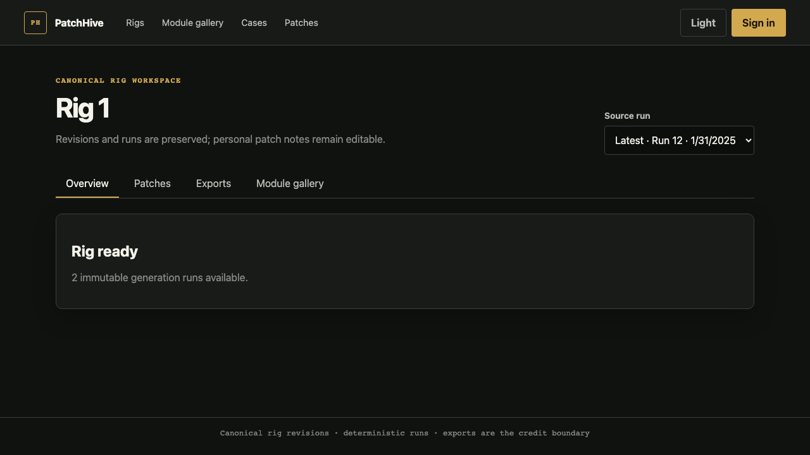
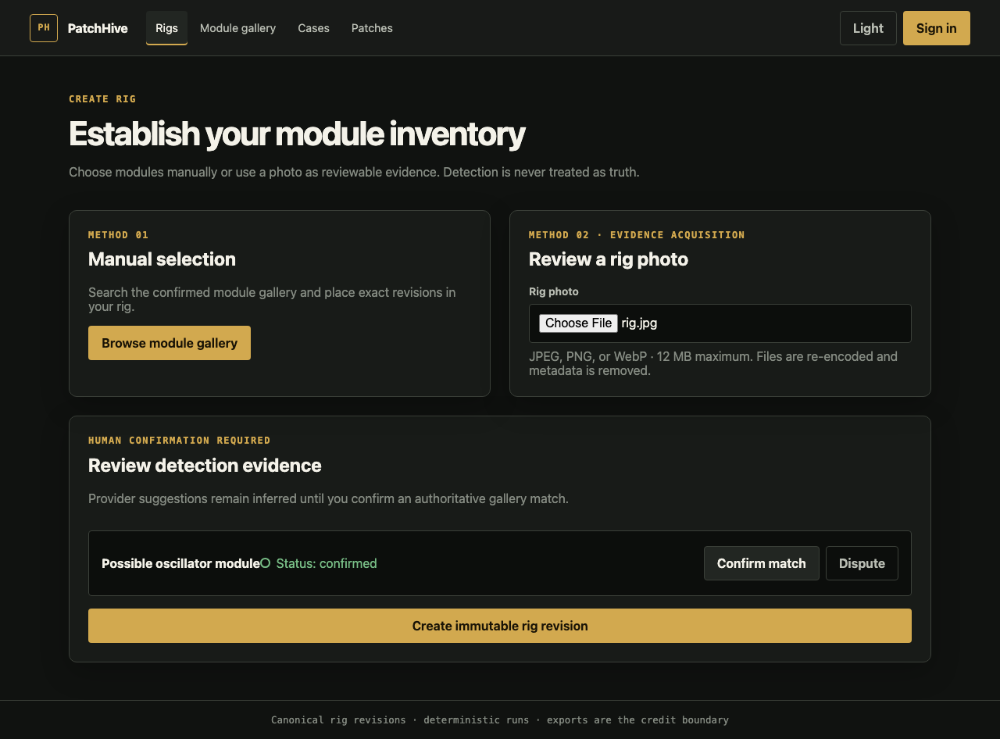
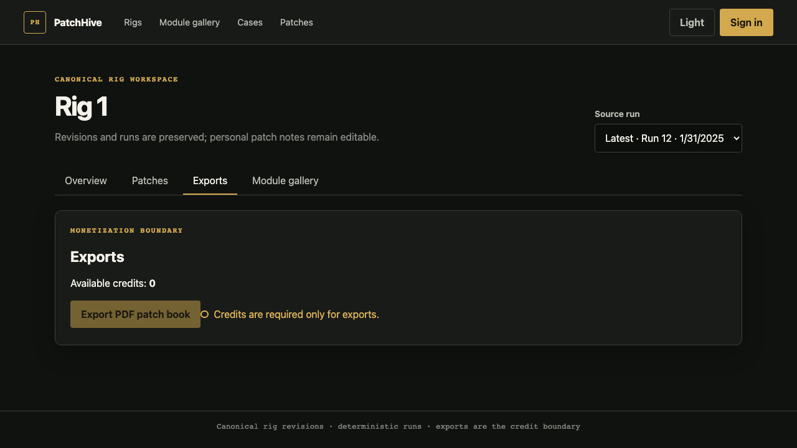

# Validation evidence

**Campaign:** PR #47 · branch `codex/patchhive-oneshot-canon-alignment` · 2026-07-20

These screenshots were captured from the deterministic Playwright routes in `frontend/tests/ui/mvp.spec.ts` after all four browser tests passed. API responses are mocked so the evidence does not depend on a live account, production data, or payment system.

## Local / CI gates (OBSERVED)

| Suite | Result | Notes |
|-------|--------|-------|
| Backend unit/api | 144 passed, 2 xfailed | Acceptance excluded without Docker on some hosts |
| Frontend unit (Vitest) | 49 passed | |
| Playwright MVP | 4 passed | Source of screenshots below |
| PR CI Backend Tests 3.11/3.12 | SUCCESS | PostgreSQL 15 provisioned |
| PR CI Code Quality | SUCCESS | |
| PR CI Security / SBOM | SUCCESS | |
| Acceptance w/o Postgres/Docker | NOT_COMPUTABLE | Use CI, not a local pass claim |
| Golden compile hash | `c2356d416b9784d4487ffadf1fc6aafb974644f0767a5a36cba44d7f397934ee` | |

Commands: see root [README.md](../README.md#validation) and [CONTINUATION.md](CONTINUATION.md).

## Canonical rig workspace

## Photo evidence resolution

## Export credit boundary

## Gaps

- Staging browser evidence against real API is **not** captured yet (CONTINUATION P3).
- No production traffic evidence exists; none claimed.
