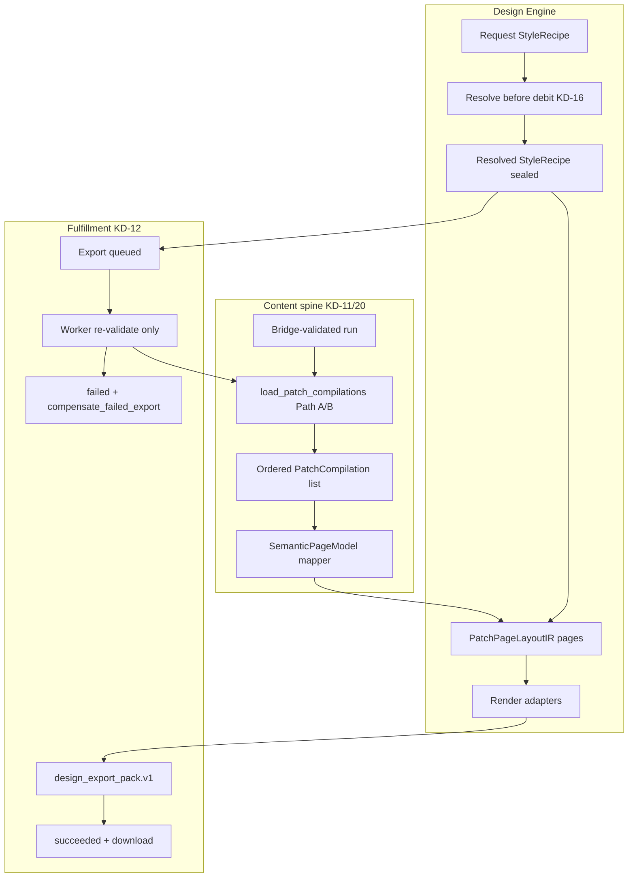
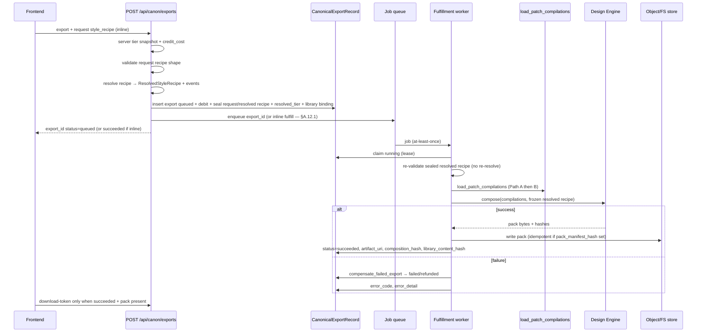

# PatchHive PatchBook Design Engine

| Field | Value |
|-------|-------|
| **Document** | PatchBook Export Design Engine (Zero State product) |
| **Author** | Systems Architecture (PatchHive / Zero State) |
| **Date** | 2026-07-20 |
| **Revision** | 2026-07-20-r3 (content load path + multi-patch + resolve-before-debit) |
| **Status** | **Approved** (design-doc review consensus, 0 open issues) |
| **Product** | PatchHive — a Zero State product |
| **Scope** | Presentation layer above/alongside the Patch Book Generator compiler |
| **Related** | `docs/PATCH_BOOK_GENERATOR.md`, `backend/export/patchbook/*`, `backend/canon/*`, `docs/brand/VISUAL_IDENTITY.md` |

---

## Overview

PatchHive today has **four related but separate surfaces** that this design must not collapse:

1. **Canon ledger export** — `POST /api/canon/exports` via `request_export` (`backend/canon/exports.py`) creates a `CanonicalExportRecord` with `status="queued"`, debits credits, and **does not generate a PDF**. Acceptance tests assert status remains `"queued"`.
2. **Legacy PDF render** — `backend/export/routes.py` + `backend/export/patchbook/` (`build.py` → `builder.py` → `render_pdf.py`, ReportLab, `PATCHBOOK_TEMPLATE_VERSION = 1.1.0`). Debit path returns **410** when `ENABLE_LEGACY_PATCHBOOK_DEBIT=false`.
3. **Canon compilation pack** — `backend/canon/export_pack.py` writes sealed `patch_graph.json` / `patch_plan.json` / `validation_report.json` + a topology SVG **placeholder** — not a PatchBook PDF or multi-root publication pack.
4. **CLI ArtifactStore** — `patchhive/store/artifact_store.py` expects `runs/<id>/pdf/patchbook.pdf` for pipeline/CLI layouts; not the HTTP canon debit path.

This document specifies the **PatchBook Design Engine**: a premium, deterministic publication system that transforms immutable PatchHive patch data into collectible, printable artifacts—while **owning the missing fulfillment seam** from queued canon export → succeeded pack. Styling may recompose, restyle, annotate, and visualize; it may never mutate canonical patch truth.

Creative directive: **not a report generator**. The Design Engine is a deterministic publishing instrument layered **above** `docs/PATCH_BOOK_GENERATOR.md` invariants.

**MVP acceptance boundary (S0–S2):** contracts, resolver, content-spine mapper, **export fulfillment worker** with default recipe + Signal Manual, preview API, Style Studio MVP, branding. Families 2–12, publication/artistic modes, and advanced mixer are **subsequent epics** (S3–S6), not “fifteen equal near-term PRs.”

---

## Background & Motivation

### Current state (four surfaces)

| Surface | Location | Role today | Produces PDF? |
|---------|----------|------------|---------------|
| **Publishing law** | `docs/PATCH_BOOK_GENERATOR.md` | One patch = one standalone page; PatchPageSpec / PageFitReport / PatchBookManifest | Spec only |
| **Legacy PDF stack** | `backend/export/patchbook/` + `export/routes.py` | ORM `Patch`/`Rack` → `PatchBookDocument` → ReportLab; tiers free/core/pro/studio for **insights**; free `PREVIEW` watermark | **Yes** (debit path disabled by default) |
| **Canon ledger** | `backend/canon/exports.py`, `routes.py` | Atomic debit + `CanonicalExportRecord` (`queued`); download-token allows queued/running/succeeded | **No** |
| **Canon compilation pack** | `backend/canon/export_pack.py`, `compiler.py` | Sealed graph/plan/validation JSON + placeholder SVG | **No** |
| **CLI ArtifactStore** | `patchhive/store/artifact_store.py` | File layout for runs including `pdf/patchbook.pdf` | Pipeline-dependent |
| **Frontend debit** | `frontend/src/lib/api.ts` `canonApi.createExport`; `RigDetail.tsx` | Debit only; no style recipe; no poll-to-PDF | No |
| **Brand system** | `docs/brand/*`, `brand/zero-state/`, `brand/patchhive/` | Cyber Hive tokens (`#F5A623` amber); PDF branding still `#111827` / `#F59E0B` Helvetica | N/A |
| **Missing-data vocab** | `backend/canon/visual_contracts.py` | `ResolutionStatus.UNKNOWN` / `NOT_COMPUTABLE` for vision/inventory | Not used by patchbook renderer today |

### Pain points

1. **Fulfillment gap** — users can be charged for a canon export that never leaves `queued`.
2. **Single visual grammar** on the legacy ReportLab path.
3. **No style recipe surface** bound to ledger exports.
4. **Brand lag** — PDF accent `#F59E0B` ≠ cyber-hive `#F5A623`; no Zero State parent credit.
5. **Dual content assembly** — generate writes ORM `patches` + sealed IR (`generation_ir` / `connections`); bridge creates empty `PatchLibraryRecord` with a **synthetic** `artifact_manifest_hash` (`native_artifact_manifest_hash` in `backend/runs/bridge.py`) and does **not** dual-write `GeneratedPatchRecord` graph/plan/validation JSON.
6. **Client-influenced tier** on legacy path (`PatchBookTier` query/body) with no entitlement model.
7. **No dual profile** for collector/gallery without violating one-patch-one-page.

### Product laws

- Fail-closed; no invent; evidence never self-confirms.
- Exports are immutable provenance-bound artifacts.
- No live production payments without `ALLOW_PRODUCTION_PAYMENTS`.
- Prefer extending the **canon export boundary**, not reviving legacy debit.

---

## Goals & Non-Goals

### Goals

1. Close the **canon export fulfillment** gap: queued → running → succeeded|failed/refunded with downloadable pack.
2. Ship Design Engine layers A–F with deterministic pipeline and **request vs resolved** style recipes.
3. **Single content spine** from sealed canon compilation (mapper to page model).
4. Master sliders, influence mixer (with conflict groups), modes, and eventually ≥12 families — **MVP = Signal Manual E2E**.
5. Style Studio UX; recipes sealed on `canonical_exports` + pack.
6. Server-side tier/entitlement authority (no client `tier` spoof).
7. Dual profiles with compliance matrix; artistic modes fail-closed with appendix + compensation.
8. Cyber Hive product identity; understated Zero State via machine-readable `BrandSurfacePolicy`.

### Non-Goals

- Not audio DSP / hardware control / live session tooling.
- Not free-form non-deterministic design tools.
- Not abandoning one-patch-one-page for execution books.
- Not inventing missing modules/ports/validation.
- Not Zero State as cover hero; not “AAL product” language.
- Not re-enabling production payments or legacy debit as primary path.
- Not shipping 12 families before fulfillment + one vertical E2E slice.

---

## Key Decisions

| # | Decision | Rationale |
|---|----------|-----------|
| **KD-1** | Dual profiles: `execution_page` vs `publication` | Preserves `PATCH_BOOK_GENERATOR.md` for rack use; enables collector spreads with technical companion. |
| **KD-2** | SVG layout IR is composition authority; ReportLab and SVG→PDF are adapters | Deterministic goldens; matches schematic SVG path; Chromium optional later only. |
| **KD-3** | Style Studio on FE; resolver + layout composer on BE | Server-authoritative composition; preview calls same engine. |
| **KD-4** | Style recipe is sealed metadata on export + pack; never mutates Layer A | Content hash and recipe hash are separate axes. |
| **KD-5** | Tier/features resolved **server-side only**; client never sends `tier` | No entitlement model today; prevent spoofing studio features. |
| **KD-6** | Artistic modes force disclosure + dual-artifact technical appendix; fail → compensate | Safety + honesty after debit. |
| **KD-7** | Constraint authority order hard-coded; conflicts emit events | UX explains clamps; no silent override. |
| **KD-8** | Zero State understated; PatchHive Cyber Hive hero | Brand law. |
| **KD-9** | Independent `design_engine_version` axis | Replay tuple includes engine + family + recipe + seed + profile. |
| **KD-10** | Extend `/api/canon/exports`; do not revive legacy debit | Ledger is sole debit boundary. |
| **KD-11** | **Content spine = ordered list of sealed `PatchCompilation`s** (one per patch); never live rack re-query for cable endpoints | Product runs are multi-patch; Layer A is immutable sealed JSON. |
| **KD-12** | **Export fulfillment worker is in-scope v1**; debit without compose is incomplete product | Closes queued-forever gap. |
| **KD-13** | **v1 recipe binding: required DB columns** on `canonical_exports` + pack mirror; server idempotency material includes **resolved** `style_recipe_hash` | Pack-only binding is orphaned until fulfillment; client key namespacing is insufficient. |
| **KD-14** | **v1 credit cost = `settings.patchbook_export_cost` (3)** for all recipes/formats; ignore client `credit_cost` when Design Engine flag on | Stops under-reporting; pricing matrix deferred. |
| **KD-15** | **Preview is free, rate-limited, no debit**; max pages/cables enforced | Protects CPU; separates studio iteration from export. |
| **KD-16** | **Request recipe vs resolved recipe** split; **resolve on API thread before debit** (and on preview); worker re-validates frozen resolved recipe only | Prevents resolve drift mid-flight; idempotency hash is known at debit. |
| **KD-17** | Dual-run both adapters from **one sealed fixture compilation set** (SemanticPageModel), not live ORM builder | Fair oracle; byte-identical PDF not required. |
| **KD-18** | Until entitlements exist, server default tier = **`core`** (flag-overridable admin map) | Watermark/feature gates have a single authority. |
| **KD-19** | **Bridge `artifact_manifest_hash` is an export binding key only** (synthetic `patchhive:gen-run:…`); **library content integrity uses separate `library_content_hash` / compilation hashes** | Matches `backend/runs/bridge.py` today; do not pretend bridge hash verifies graph bytes. |
| **KD-20** | **MVP content load: compile-on-export (Path B) from immutable run-bound patch rows**; dual-write `GeneratedPatchRecord` at generate (Path A) is the preferred steady state and lands in the same epic | Unblocks PR-04/05 without requiring generate rewrite on day one; Path A becomes default when dual-write ships. |

---

## Proposed Design

### A. Design Specification

#### A.1 Architecture layers (strict separation)

```text
A Canonical Content     — sealed PatchCompilation (graph, plan, validation)
B Information Architecture — priority maps, section semantics, density scoring
C Layout Grammar        — grids, page rhythm, Layout IR, fit classes
D Visual Language       — tokens, type, diagram strokes, BrandSurfacePolicy
E Expressive Influence  — mode weights, style mixer, seeded ornament
F Output Adaptation     — a11y, print preflight, PDF/SVG/HTML/PNG/ZIP adapters
```

**Law:** Layer E never writes Layer A. Layers C–F may compress optional prose under budgets; never drop required warnings, connections, or provenance. Missing fields render `UNKNOWN` or `NOT_COMPUTABLE` (vocabulary aligned with product law; patchbook adopts labels even though `ResolutionStatus` today lives in vision contracts).



#### A.2 Pipeline stages and receipts

```text
Sealed PatchCompilation
  → Content Classification
  → Information Priority Map
  → Template Family selection
  → Weighted Style Vector (normalize influences)
  → Constraint Resolver → Resolved StyleRecipe + events
  → Layout Composer → PatchPageLayoutIR[]
  → Diagram Renderer (SVG assets)
  → Typography Engine (text runs in IR)
  → Decorations (seeded, non-destructive)
  → Accessibility Validator
  → Print/Screen Preflight
  → Adapters → PDF / SVG / HTML / PNG / ZIP
```

Each stage emits a versioned **stage receipt** (JSON). See §E.6.

#### A.3 Constraint authority order

| Rank | Constraint |
|-----:|------------|
| 1 | Canonical integrity |
| 2 | Required warnings |
| 3 | A11y / output profile floors |
| 4 | Explicit mode |
| 5 | Legibility |
| 6 | Information hierarchy |
| 7 | Template family |
| 8 | Style influences |
| 9 | Decorations |
| 10 | Seeded variation |

##### Conflict examples (explained, not silent)

**Conflict 1 — Surrealism vs required warnings**  
Requested high surrealism/ornament on feedback patch → Rank 2 keeps warnings full-contrast; decorations confined to margins/front matter. Event code: `CLAMP_ORNAMENT_AWAY_FROM_WARNINGS`.

**Conflict 2 — Experimental typography vs Professional + execution_page**  
Requested `experimental_typography: 70` in professional mode → resolver **clamps** to ≤40 (mode defaults typically 5). Does **not** hard-fail request validation. Event: `CLAMP_EXPERIMENTAL_TYPOGRAPHY`. Hard-fail only if artistic mode lacks disclosure/appendix flags after resolution policy (§A.6).

**Conflict 3 — White space vs dense patch fit**  
High white_space on 24-cable execution page → Rank 1–3+6 reduce white_space until PageFit passes or reject with `PATCH_PAGE_TEXT_OVERFLOW` / remediation to publication profile. Event: `CLAMP_WHITE_SPACE_FOR_FIT`.

#### A.4 Master control sliders (0–100)

| Slider | Default | Notes |
|--------|--------:|-------|
| legibility | 90 | Default authority |
| technical_density | 75 | |
| editorial_expression | 55 | |
| symbolism | 10 | |
| abstraction | 5 | |
| surrealism | 0 | |
| ornamentation | 20 | |
| grid_rigidity | 80 | |
| white_space | 55 | |
| visual_motion | 35 | Screen only |
| materiality | 25 | |
| brand_presence | 15 | PatchHive |
| diagram_literalness | 90 | |
| historical_influence | 10 | |
| experimental_typography | 5 | Resolver clamps >40 outside artistic modes |

`zero_state_presence = min(brand_presence * 0.4, 12)` — permitted surfaces only (§C.6, BrandSurfacePolicy).

#### A.5 Style influence mixer (implementable)

**Axes (0–100 each):**  
engineering, scientific, swiss, editorial, industrial, architectural, museum, archival, technical_manual, field_notebook, patent, blueprint, circuit_board, oscilloscope, cyber_hive, brutalist, minimal, luxury, organic, biomorphic, symbolic, ritual, abstract, surreal, futurist, retro_futurist, analog_studio, modular_synth, record_packaging, data_visualization, generative_geometry, open_form_zero_state

##### Conflict groups (L1-normalize within group if sum > 100)

| Group id | Members | Residual policy |
|----------|---------|-----------------|
| `g_density` | engineering, scientific, technical_manual, archival, patent, data_visualization | Excess folded into `technical_density` slider pressure (+), not Layer A |
| `g_minimal` | minimal, swiss, open_form_zero_state | Competes with ornamentation slider (−0.5× normalized minimal) |
| `g_ornate` | luxury, ritual, record_packaging, organic, biomorphic | Competes with g_minimal; loser scaled down |
| `g_signal` | circuit_board, oscilloscope, cyber_hive, modular_synth, blueprint | Prefer diagram stroke/token families |
| `g_space` | architectural, museum, field_notebook | Margin and section-open grammar |
| `g_expression` | editorial, brutalist, symbolic, abstract, surreal, futurist, retro_futurist, analog_studio, generative_geometry | Only after Rank 4 mode allows |

Groups are disjoint by **primary** membership; multi-membership axes use primary group only (table above). Deterministic order: sort group ids, normalize each, then apply transfer functions.

##### Influence → parameter transfer (sparse v1)

| Influence (post-norm 0–1) | Affects |
|---------------------------|---------|
| `minimal` | `ornamentation_eff = ornamentation * (1 - 0.6*minimal)`; margin scale + |
| `technical_manual` | `technical_density_eff += 20*tm`; table compactness + |
| `cyber_hive` | diagram token set → amber/cyan; honeycomb decoration budget + |
| `blueprint` | diagram algorithm preference `orthogonal_schematic`; color_mode bias bw |
| `brutalist` | type scale display weight +; white_space_eff − |
| `museum` | plate margins +; in publication, caption zone required |
| `surreal` / `abstract` | decoration seed amplitude +; **blocked** from moving cable endpoints |
| `oscilloscope` | mono readout styling; graticule decoration |
| `generative_geometry` | seed-driven margin geometry only outside required regions |

**Property tests:** same influences → same normalized vector; no edge/port mutation; group sums ≤ 100 after normalize.

#### A.6 Modes and artistic matrix

| Mode | Defaults (see §E.7 full table) | Disclosure | Appendix | Profile rule |
|------|--------------------------------|------------|----------|--------------|
| Professional | high legibility | No | Optional | execution_page default |
| Editorial | editorial_expression↑ | No | Optional | either |
| Collector | materiality↑ | Soft if plates omit regions | **Required if any non-execution body page** | publication common |
| Educational | instruction-first bias | No | Optional | execution_page default |
| Technical Archive | max density | No | N/A | execution_page |
| Symbolic | symbolism↑ | **Required** | **Required** | force dual-artifact |
| Abstract | abstraction↑ | **Required** | **Required** | force dual-artifact |
| Surreal | surrealism↑ | **Required** | **Required** | force dual-artifact |
| Gallery | max expression | **Required** | **Required** | force dual-artifact + identity |

**Disclosure copy:**  
> This mode prioritizes visual interpretation over complete technical readability. A canonical technical appendix will remain available.

**Artistic × profile matrix**

| mode artistic? | book_profile request | Resolution |
|----------------|----------------------|------------|
| Yes | `publication` | OK if disclosure+appendix flags; emit publication primary + execution appendix artifact |
| Yes | `execution_page` | **Force dual-artifact**: primary may still be execution-styled pages **or** plates only if `page_kind` marks non-executable plates **and** full `appendix_execution` set passes Execution gates; never single-artifact artistic export |
| No | either | Standard; Collector publication without plates may omit appendix; Collector with plates requires appendix |

Resolver **sets** `require_technical_appendix=true` for artistic modes (hard). Missing `disclosure_accepted` after UI → hard fail `ARTISTIC_DISCLOSURE_REQUIRED` **before debit** when possible; if worker re-validates and fails → `compensate_failed_export`.

#### A.7 Dual profiles and page kinds

##### Page kind

```text
page_kind:
  execution          — one patch, standalone, full required regions
  plate              — artistic/publication visual; NOT sufficient alone for rack patching
  front_matter       — cover, TOC, legend (no patch execution dependence)
  back_matter        — index, colophon, license
  appendix_execution — technical companion pages; must satisfy Execution Page Profile
```

##### Dual-profile compliance matrix

| Invariant (`PATCH_BOOK_GENERATOR.md`) | execution_page | publication plate | appendix_execution |
|---------------------------------------|----------------|-------------------|--------------------|
| One patch = one page | **Required** | N/A (may multi-page narrative per patch) | **Required** (one patch per appendix page) |
| No facing-page dependency for required content | **Required** | Plates may pair visually; **required execution facts must not live only on a facing plate** | **Required** |
| QR/online may not hold required execution info | **Required** | **Required** | **Required** |
| No clip/truncate required content | **Required** | Plates may omit regions if `page_kind=plate` **and** appendix covers them | **Required** |
| Type floor / grayscale / non-color cables | **Required** | Soft for pure art regions; text labels still contrast-safe | **Required** |
| Page identity footer (patch id, hashes) | **Required** every execution page | Artifact identity strip required; full hash footer may be compact | **Required** |

**Execution footer algorithm (family-independent):** every `execution` and `appendix_execution` page must render a footer band containing at minimum: `patch_id` (or artifact id), `page_kind`, short `content_canonical_hash` (16 hex), `style_recipe_hash` (8 hex), `design_engine_version`, folio. Families may style the band but may not remove fields. Open State “sparse” aesthetic moves secondary branding to colophon **only after** this footer band is satisfied.

**System maps in front matter:** multi-patch overview maps may appear in front matter for navigation only; they **must not** be the sole carrier of ordered connections or warnings for any patch (law §2.5 spirit).

**Facing spreads (publication):** allowed for `plate` + caption; prohibited as sole carrier of required execution content.

#### A.8 Template architecture

```text
template_families/<family_id>/
  family.json          # includes layout_algorithm_id, structural_fingerprint
  layouts/*.yaml
  diagrams/grammar.yaml
  tokens/{print,screen}.json
  fixtures/
```

**Plugin interface (required method):** `layout_algorithm_id` — not palette-only. Examples: `orthogonal_schematic`, `hex_cell_map`, `seeded_force_cartography`, `title_block_engineering`, `gallery_plate_mat`, `crt_bezel_frame`, `notebook_checklist`, `brutalist_blocks`, `radial_seal_frame`, `open_form_generative`.

##### Structural fingerprint (Acceptance #11)

```yaml
structural_fingerprint:
  layout_algorithm_id: string
  grid_modules: [columns, baseline_pt, margin_ratio]
  region_graph: sorted list of region_id edges (identity→diagram→…)
  type_role_set: [display, body, mono, caption, footer]
  diagram_encoding: [color, dash, number, label]  # must include non-color
  default_page_kinds: [execution] | [plate, appendix_execution] | …
  rhythm_signature: string  # e.g. diagram_first_55_25_20
```

CI: pairwise Hamming/Jaccard distance on fingerprint fields ≥ threshold `STRUCT_MIN_DISTANCE=0.35` (configurable); pure color-token diffs do not count.

#### A.9 Accessibility & output rules

Align `PATCH_BOOK_GENERATOR.md` §10 and `docs/ACCESSIBILITY.md`. Production export: a11y failure = compile failure. Metrics: min contrast body text ≥ 4.5:1; grayscale cable discrimination via dash+number; min print body 9.5 pt.

#### A.10 Determinism contract

Identical when all match: content canonical hash, design_engine_version, template_family+version, **resolved** weights+influences, layout constraints, generation_seed, output_profile, layout IR schema version.

#### A.11 Content spine (KD-11) — load path, multi-patch, mapper

##### A.11.0 Reality check (product generate → export today)

| Step | Code | What is stored |
|------|------|----------------|
| Generate | `POST …/patches/generate/{rack_id}` (`backend/patches/routes.py`) | Integer `runs` row; ORM `patches.models.Patch` with `connections`, `generation_ir`, `provenance`, seeds — **not** `GeneratedPatchRecord` |
| Bridge | `ensure_legacy_run_export_bridge` (`backend/runs/bridge.py`) | `RigRevisionRecord` (rack snapshot), `GenerationRunRecord`, empty **`PatchLibraryRecord`** with **synthetic** `artifact_manifest_hash = sha256("patchhive:gen-run:{run}:rig:{rack}:content:{content_hash}")` |
| Export debit | `POST /api/canon/exports` | Client sends bridge fields; ledger row `queued`; **no PDF, no compilations loaded** |
| Sealed compilations | `GeneratedPatchRecord` (`patch_graph` / `patch_plan` / `validation_report` JSON) | **Table exists; generate does not dual-write** |
| Compiler | `backend/canon/compiler.py` → `PatchCompilation` | Used in tests/pipeline demos; **not** on RigDetail path |

**KD-19:** The bridge hash is an **export binding key** tying debit to a run+rack-layout snapshot. It is **not** a content hash of sealed graphs. Design Engine integrity uses separate hashes (below).

##### A.11.1 Content load algorithm (v1) — ordered fallbacks

Public API used by preview + fulfillment:

```python
# backend/export/patchbook/design/content_spine.py

def load_patch_compilations(
    session: Session,
    *,
    source_run_id: str,
    source_rig_revision_id: str,
    artifact_manifest_hash: str,  # bridge binding key (KD-19)
) -> LoadedLibrary:
    """Return ordered sealed compilations for Design Engine Layer A.

    Never uses builder.py + live RackModule for cable endpoints.
    """
```

**Path A — Preferred steady state (dual-write at generate)**  
*Lands in PR-04b (same epic as spine); becomes default when present.*

1. Resolve `PatchLibraryRecord` by `run_id == source_run_id` (id form `library-{source_run_id}` as bridge creates today).
2. Verify request `artifact_manifest_hash == library.artifact_manifest_hash` (binding key match) else `EXPORT_BRIDGE_HASH_MISMATCH`.
3. Load `GeneratedPatchRecord` rows for `patch_library_id`, order by **`position` ASC**.
4. If count == 0 → fall through to Path B (MVP transitional) **or** fail if `REQUIRE_SEALED_GENERATED_PATCHES=true` (post-cutover).
5. Deserialize each row’s `patch_graph` / `patch_plan` / `validation_report` (+ variations) into `PatchCompilation` (or partial compile struct); verify each `canonical_hash` matches sealed JSON.
6. Compute **`library_content_hash`** = `sha256(canonical_json([{position, canonical_hash}, ...]))` and store on export row / pack. This is the integrity hash Design Engine trusts—not the bridge string.
7. Return `LoadedLibrary(compilations=..., library_content_hash=..., load_path="generated_patches")`.

**Generate dual-write (Path A producer)** — extend `generate_patches` after ORM `Patch` save:

1. For each saved patch at index `i`, run deterministic **`seal_orm_patch_to_compilation(patch, rig_revision, source_run_id)`** (same pure function as Path B).
2. Insert `GeneratedPatchRecord(id=…, patch_library_id=library_id, position=i, name=…, patch_graph=…, patch_plan=…, validation_report=…, canonical_hash=…)`.
3. Optionally update `PatchLibraryRecord.canonical_hash` to `library_content_hash` (today it is `_stable_hash("patch-library:…")` placeholder — migrate carefully).

**Path B — MVP transitional: compile-on-export / compile-on-preview**  
*Default until Path A rows exist for the run. Implemented first in PR-04 so PR-05 can fulfill real RigDetail exports.*

1. Resolve bridge identity: parse integer run id from `source_run_id` form `gen-run-{run_id}-{content_hash16}` **or** join `GenerationRunRecord` → map to integer `runs.id` via bridge convention; load `Run`.
2. Verify `artifact_manifest_hash` equals `native_artifact_manifest_hash(run_id, rack_id, rack_content_hash)` recomputed from **sealed** `RigRevisionRecord.canonical_rig` (not a fresh live snapshot if revision already stored). Mismatch → `EXPORT_BRIDGE_HASH_MISMATCH`.
3. Load ORM `Patch` rows: `Patch.run_id == integer_run_id`, order by **`Patch.id ASC`** (stable generation order). Empty → `EXPORT_NO_PATCHES`.
4. For each patch, call **`seal_orm_patch_to_compilation`** (pure, deterministic):

```text
Inputs (immutable, run-bound — not live rack mutation):
  - patch.connections (JSON as stored at generate)
  - patch.name, category, description, generation_seed, generation_version
  - patch.generation_ir / provenance (if present)
  - RigRevisionRecord.canonical_rig module placement snapshot (for HP/position display only)
  - Module catalog rows joined by module_id **as of revision snapshot module_ids only**
    (names/HP for labels; if module row missing → UNKNOWN — do not invent ports)

Outputs:
  - PatchGraph (nodes/edges/ports from connections; edge order stable sort)
  - PatchPlan (title/intent from name/description; steps from connection order
    mapped into prep/threshold/peak/release/seal phases deterministically)
  - ValidationReport (structural checks only; no fabricated safety claims)
  - canonical hashes on each artifact
  - PatchCompilation

Forbidden:
  - Re-query current RackModule layout to change endpoints
  - builder.py as Layer A
  - Reading another run’s patches
```

5. **Cache optional:** write resulting `GeneratedPatchRecord`s if library empty (lazy dual-write) so subsequent previews hit Path A.
6. `library_content_hash` as in Path A.
7. Return `load_path="compile_on_export"`.

**Path C — Forbidden for Design Engine Layer A**

- `builder.py` + live `Session` rack/module graph as source of cable endpoints while claiming KD-11.
- Trusting client-supplied compilation JSON without server seal.
- Using only `export_pack.py` demo fixtures for product debit.

##### A.11.2 Multi-patch library assembly

| Concern | v1 rule |
|---------|---------|
| Unit of compilation | **One** `PatchCompilation` per patch (matches `canon.contracts.PatchCompilation`) |
| Book input | `list[PatchCompilation]` ordered |
| Order | Path A: `GeneratedPatchRecord.position`; Path B: `Patch.id ASC` |
| Pages | Each compilation → ≥1 page per profile rules; execution profile → **exactly one** `page_kind=execution` page per compilation (or reject that patch) |
| Front/back matter | Once per book, not per patch |
| `artifact_manifest_hash` | Bridge binding for the **library/run**, shared across all patches |
| `library_content_hash` | Hash of ordered per-patch `canonical_hash` list |
| Partial failure | **All-or-nothing** for v1: any patch PageFit/a11y/compose fail → entire export `failed` + `compensate_failed_export`; no partial PDF download |
| Selection subset | v1 exports **all** patches in the run library; patch_id filter is post-MVP |
| MVP fixtures | Multi-patch runs with ≥1 sparse and ≥1 dense patch in the same library |

```text
load_patch_compilations(...) ->
  LoadedLibrary
    source_run_id
    source_rig_revision_id
    bridge_artifact_manifest_hash   # KD-19 binding key
    library_content_hash            # integrity
    load_path: generated_patches | compile_on_export
    items: list[{ position, orm_patch_id?, generated_patch_id?, compilation: PatchCompilation }]
```

##### A.11.3 Semantic field mapping (after load)

| Semantic page field | Source |
|---------------------|--------|
| identity / title | `PatchPlan.title`, graph `artifact_id` |
| intent / purpose | `PatchPlan.intent` + plan phases |
| ordered connections | `PatchGraph.edges` ordered by plan steps; ports from node defs |
| starting settings | plan prep/threshold — never invented |
| warnings | `ValidationReport.issues` (error/critical/warning) |
| modules | graph nodes → module ids from sealed graph / snapshot |
| missing | absent ports/voltages → `UNKNOWN` / `NOT_COMPUTABLE` |
| patching order | plan phases prep→threshold→peak→release→seal |

**Transitional DTO:** adapters may project `list[PatchCompilation]` → `PatchBookDocument` for ReportLab **without** re-entering builder’s DB queries for connections.

##### A.11.4 Hash responsibilities

| Hash | Meaning |
|------|---------|
| `artifact_manifest_hash` (export request/DB) | Bridge binding key (KD-19); must match library row |
| `library_content_hash` | Ordered patch compilation identities |
| per-patch `canonical_hash` | Sealed graph/plan/validation |
| `style_recipe_hash` | Resolved recipe |
| `composition_hash` | content library + resolved recipe + layout IRs + engine version |

#### A.12 Export Fulfillment (KD-12) — critical seam

This section owns the gap between ledger debit and downloadable PDF.



**Resolve-before-debit (KD-16) — explicit:**

| When | Action |
|------|--------|
| Preview API | `resolve_style_recipe(request, tier_snapshot, engine_version)` → return resolved + events; **no** debit |
| Export API **before** `request_export` / debit | Same resolve function; persist `request_style_recipe_json`, `resolved_style_recipe_json`, `style_recipe_hash=hash(resolved)`, `resolved_tier`, `design_engine_version` |
| Worker | **Must not** call full resolver with live tier. Load sealed resolved JSON; verify `hash(resolved)==style_recipe_hash` and `engine_version` match; on mismatch → `DESIGN_RECIPE_RESOLVE_DRIFT` + compensate. Tier feature checks use **`resolved_tier`** snapshot column only |

Idempotency material (debit time) therefore has a real resolved hash.

##### A.12.1 Worker contract

**Entrypoint:** `backend/canon/fulfillment.py` · `fulfill_export(session, export_id) -> FulfillResult`

| Rule | Spec |
|------|------|
| Delivery | At-least-once; handler must be **idempotent** |
| Succeeded short-circuit | If `status==succeeded` and `pack_manifest_hash` set and pack bytes exist → no-op success |
| Max attempts | **5** (configurable `EXPORT_FULFILL_MAX_ATTEMPTS`) |
| Backoff | Exponential: 10s, 30s, 2m, 10m, 30m |
| Running lease | `running_started_at` + lease **15 minutes**; reclaim: if lease expired → requeue or fail+refund after max attempts (`EXPORT_FULFILL_STUCK`) |
| Attempts counter | `fulfill_attempts` column; increment on each claim |
| Inline mode | `ENABLE_INLINE_EXPORT_FULFILLMENT=true`: **after DB commit of queued+debit**, call `fulfill_export` **synchronously** on the request thread and return final status in the HTTP response when possible; acceptance tests use inline mode so they are not stuck on `queued`. **Do not** hold the debit transaction open across PDF render — commit ledger first, then fulfill |
| Async mode | Enqueue after commit; API returns `queued`; client polls |

**Inputs:**

- `CanonicalExportRecord` including sealed recipes, `resolved_tier`, bridge ids, `artifact_manifest_hash`
- `load_patch_compilations(...)` result (`library_content_hash`, ordered compilations)
- Frozen design engine version

**Outputs (authoritative pack schema):**

Primary schema id: **`patchhive.design_export_pack.v1`**:

```text
{export_root}/
  manifest.json                 # design_export_pack.v1 + library_content_hash + bridge hash
  PatchBook.pdf
  technical/                    # when appendix required
    PatchBook-execution.pdf
    pages/json/*.json
  style/
    request_recipe.json
    resolved_recipe.json
    resolution_events.json
  pages/svg/*.svg
  pages/json/*-layout-ir.json
  diagrams/svg/*.svg
  source/
    library_index.json          # ordered positions + per-patch canonical_hash
    patches/{position}/graph.json
    patches/{position}/plan.json
    patches/{position}/validation.json
  validation/page-fit/*.json
  validation/a11y/*.json
  validation/print-preflight.json
  LICENSE.txt
  README.txt
```

**Relationship to other pack schemas:**

| Schema | Role |
|--------|------|
| `patchhive.export_pack.v1` (`export_pack.py`) | Single-compilation seal helper; not product download |
| `patchhive.patch_book_manifest.v1` | Embedded pages[] publishing-law fields |
| `patchhive.design_export_pack.v1` | **Authoritative multi-patch product download** |

**Artifact storage:** `settings.export_store_root/exports/{export_id}/` (new). Optional CLI mirror. DB: `artifact_uri`, `pack_manifest_hash`, `composition_hash`, `library_content_hash`, status.

**Status machine:** `queued` → `running` → `succeeded` | `failed` | `refunded`  
Terminal failure → `compensate_failed_export`.  
Download token: **`status == "succeeded"` and pack present only**.

**Error codes:**

- `DESIGN_ARTISTIC_APPENDIX_FAILED`, `DESIGN_A11Y_FAILED`, `DESIGN_PREFLIGHT_FAILED`, `DESIGN_LAYOUT_IR_INVALID`
- `EXPORT_BRIDGE_HASH_MISMATCH`, `EXPORT_NO_PATCHES`, `EXPORT_CONTENT_HASH_MISMATCH` (library_content / sealed row drift)
- `DESIGN_RECIPE_RESOLVE_DRIFT`, `DESIGN_TIER_FEATURE_DENIED`, `EXPORT_FULFILL_STUCK`
- Plus `PATCH_PAGE_*` / `PATCH_BOOK_*` from publishing law

#### A.13 Integration with existing runtime

| Existing | Role after this design |
|----------|------------------------|
| `patches/routes.py` generate | Continues ORM `Patch` write; **PR-04b dual-writes `GeneratedPatchRecord`** (Path A) |
| `runs/bridge.py` | Binding key + empty library shell; hash semantics KD-19 |
| `GeneratedPatchRecord` | Steady-state Layer A store |
| `builder.py` | **Forbidden** as Design Engine Layer A; legacy route only |
| `render_pdf.py` | Adapter consuming projected document from compilations |
| `render_schematic.py` | Diagram backend behind algorithm plugins |
| `content_hash.py` | Legacy document hash; new library/composition hashes separate |
| `tiers.py` | Insights + design features from **resolved_tier** snapshot |
| `branding.py` / `pdf_meta.py` | Tokens + BrandSurfacePolicy |
| `export_pack.py` | Single-compilation test helper |
| `ArtifactStore` | Optional mirror; not fulfillment authority |
| Canon `request_export` | Extended columns; resolve-before-debit; enqueue/inline fulfill |

---

### B. UX Design — PatchBook Style Studio

#### B.1 Placement

- Route: `/rigs/:rigId/runs/:runId/patchbook/studio`
- Entry: RigDetail (“Customize PatchBook”); export history re-export with new recipe (new debit + new idempotency)

#### B.2 Studio layout

Presets · Modes · Family grid | Live Preview | Preflight / Conflicts / Export  
Master sliders · Influence mixer · Seed · Locks

#### B.3 Controls

Sliders show **requested vs resolved** after preview returns events. Randomize respects locks. Presets are editable vectors. Free tier preview watermarked.

#### B.4 Artistic gate

Modal disclosure → sets `disclosure_accepted` + `require_technical_appendix` on **request** recipe. Server re-validates.

#### B.5 Export flow

1. Preview until preflight green (or explicit override only for non-production debug flags). Preview returns the **same resolved recipe** the export API will seal.
2. `POST /api/canon/exports` with **inline** request `style_recipe`; server **resolves before debit**, seals resolved hash/tier; no client `tier`; no client `credit_cost` when Design Engine enabled.
3. Poll export status until succeeded/failed (or receive final status under inline fulfill); download token only when succeeded.

#### B.6 Empty / missing data

`UNKNOWN` / `NOT_COMPUTABLE` chips — never decorative fake values.

---

### C. Visual Design

#### C.1–C.5 Component system, light/dark, type, color, motion

As prior revision: Cyber Hive chrome; paper preview uses print tokens; Inter/Geist UI; book fonts family-specific; motion Studio-only.

**Accent alignment:** product/export tokens use cyber-hive amber **`#F5A623`** (not legacy branding `#F59E0B`).

#### C.6 Zero State + BrandSurfacePolicy

Assets: `brand/zero-state/monogram.svg`, `wordmark.svg`, `monogram-zs.jpg`.

```yaml
# BrandSurfacePolicy v1 (machine-readable)
schema_version: patchhive.brand_surface_policy.v1
forbidden_strings:
  - "AAL product"
  - "Applied Alchemy Labs product"
  - "An AAL product"
allowed_zero_state:
  - page_roles: [colophon, back_cover, about]
    max_bbox_ratio: 0.08   # of page area
    max_opacity: 0.85
    max_mark_height_pt: 18
  - page_roles: [footer]
    max_bbox_ratio: 0.02
    max_opacity: 0.55
    max_mark_height_pt: 8
  - page_roles: [pdf_metadata]
    fields: [Creator, Producer, Subject]
    creator_pattern: "PatchHive PatchBook; A Zero State Product"
allowed_patchhive_hero:
  - page_roles: [cover, title_signature]
    max_bbox_ratio: 0.12
post_check:
  - scan SVG/PDF text for forbidden_strings → fail
  - measure Zero State mark nodes vs policy → fail if oversize on body execution pages
```

Renderer + CI contract tests load this policy (PR-04).

#### C.7 Cyber Hive in books

Honeycomb ornament optional; bee mark cover/colophon only; amber/cyan signal palette for affinity families.

---

### D. Template Families (12+)

MVP ships **Signal Manual** only. Families 2–12 are epics after S2. Each requires `layout_algorithm_id` + structural fingerprint.

#### 1. Signal Manual — MVP

| Aspect | Spec |
|--------|------|
| **layout_algorithm_id** | `orthogonal_schematic` |
| **When** | Default professional rack manual |
| **Mode affinity** | Professional, Educational, Technical Archive |
| **Grid** | 12-col, 8pt baseline; margins 0.6" |
| **Cover** | Wordmark + run id + rack name; amber rule |
| **Rhythm** | diagram_first 55/25/20 default |
| **Diagram** | Literal modules, numbered cables, lane routing |
| **Type** | IBM Plex Sans + Mono |
| **Footer** | Full execution footer algorithm |
| **Print** | US Letter/A4; black + spot amber rules |
| **Tier floor** | free (features still server-tiered) |

#### 2. Hive Systems Atlas — `hex_cell_map`

Hex grid; honeycomb cells; Space Grotesk + Inter; PCB pattern ≤8% outside text; core+.

#### 3. Open State — `open_asymmetric_sparse`

6-col asymmetric; high white_space; Inter Light; generative geometry whispers; **execution footer still mandatory**; core+.

#### 4. Modular Field Notes — `notebook_checklist`

Notebook rhythm; instruction-first checklists; IBM Plex Serif + mono; warm paper; free+.

#### 5. Oscilloscope Journal — `crt_bezel_frame`

CRT bezel; performance-first; JetBrains Mono; graticule; contrast-validated dark pages; core+.

#### 6. Circuit Archive — `title_block_engineering`

Vellum grid; title block; orthogonal routing; max density; free+ (structurally distinct from Signal Manual via title_block + BOM tables + revision blocks).

#### 7. Museum of Signal — `gallery_plate_mat`

Plate + caption; Source Serif; publication + appendix; pro+.

#### 8. Patent Future — `figure_claims_two_col`

Two-column claims + figure; **document id from hash prefix labeled “Document ID (not a patent)”**; required disclaimer string constant:

`PATENT_FUTURE_DISCLAIMER = "This document is a PatchHive creative template. It is not a patent application, grant, or legal instrument."`

Must appear on cover and colophon. Strict B&W. core+.

#### 9. Patch Cartography — `seeded_force_cartography`

Map neatline; deterministic seeded layout; itinerary = ordered connections; pro+.

#### 10. Sonic Brutalism — `brutalist_blocks`

Heavy blocks; **cover title law:** full patch/book title always present in full (subtitle/secondary line if display crop used for style); never omit full title from cover accessibility tree. pro+.

#### 11. Ritual Machine — `radial_seal_frame`

Radial seals from topology hash; plan phases as threshold language; publication + appendix; studio.

#### 12. Impossible Instrument — `open_form_generative`

Plates may abstract module **drawing** only if `page_kind=plate` and `appendix_execution` carries literal diagram; artifact identity always visible; studio.

##### Family selection / tier floors

| Family | Algorithm | Tier floor (server) |
|--------|-----------|---------------------|
| Signal Manual | orthogonal_schematic | free |
| Hive Systems Atlas | hex_cell_map | core |
| Open State | open_asymmetric_sparse | core |
| Modular Field Notes | notebook_checklist | free |
| Oscilloscope Journal | crt_bezel_frame | core |
| Circuit Archive | title_block_engineering | free |
| Museum of Signal | gallery_plate_mat | pro |
| Patent Future | figure_claims_two_col | core |
| Patch Cartography | seeded_force_cartography | pro |
| Sonic Brutalism | brutalist_blocks | pro |
| Ritual Machine | radial_seal_frame | studio |
| Impossible Instrument | open_form_generative | studio |

---

### E. Data Schema

#### E.1 Request vs resolved StyleRecipe

- **RequestStyleRecipe:** shape-validated; weights 0–100; may request experimental_typography >40; may omit resolved clamps.
- **ResolvedStyleRecipe:** post-constraint; sealed to DB + pack; used for composition_hash.
- Hard-fail on request only for: invalid schema, unknown family/mode, artistic without disclosure/appendix flags, payload >64KB.
- Soft-clamp: experimental typography, white_space, ornamentation vs warnings, tier-unavailable family → downgrade family with event (or pre-debit deny if feature requires higher tier).

JSON Schema for wire format remains `patchhive.style_recipe.v1` (request). Resolved adds:

```json
{
  "resolution": {
    "events": [],
    "resolved_at_engine_version": "0.1.0"
  }
}
```

**Schema nullability fix:** `force_layout_class` is `string` enum **or omit / JSON null** via `"type": ["string", "null"]` **without** listing `null` inside `enum`.

#### E.2 Python contracts (sketch)

```python
STYLE_RECIPE_SCHEMA_VERSION = "patchhive.style_recipe.v1"
DESIGN_ENGINE_VERSION = "0.1.0"
LAYOUT_IR_SCHEMA_VERSION = "patchhive.layout_ir.v1"

class PageKind(str, Enum):
    execution = "execution"
    plate = "plate"
    front_matter = "front_matter"
    back_matter = "back_matter"
    appendix_execution = "appendix_execution"

class RequestStyleRecipe(BaseModel):
    model_config = ConfigDict(extra="forbid")
    schema_version: str = STYLE_RECIPE_SCHEMA_VERSION
    engine_version: str = DESIGN_ENGINE_VERSION
    mode: PatchBookMode
    template_family: TemplateFamilyId
    template_family_version: str = "1.0.0"
    seed: int = Field(ge=0, le=2147483647)
    weights: StyleWeights
    influences: dict[str, int] = Field(default_factory=dict)
    constraints: StyleConstraints
    output_profile: OutputProfile
    preset_id: str | None = None
    notes: str = Field(default="", max_length=500)
    # no recipe_id on request until library ships

class ResolvedStyleRecipe(RequestStyleRecipe):
    model_config = ConfigDict(extra="forbid", frozen=True)
    events: tuple[ConstraintResolutionEvent, ...] = ()

class LayoutRegion(BaseModel):
    model_config = ConfigDict(extra="forbid")
    region_id: str
    role: Literal[
        "identity", "diagram", "intent", "construction",
        "operation", "warnings", "footer", "decoration", "caption"
    ]
    required: bool
    bbox_pt: tuple[float, float, float, float]  # x, y, w, h in points
    z_index: int = 0
    reading_order: int

class TextRun(BaseModel):
    model_config = ConfigDict(extra="forbid")
    run_id: str
    region_id: str
    text: str
    style_role: Literal["display", "body", "mono", "caption", "footer", "warning"]
    font_size_pt: float
    # no free CSS

class PatchPageLayoutIR(BaseModel):
    """Authoritative composition IR before PDF/SVG adapters."""
    model_config = ConfigDict(extra="forbid", frozen=True)
    schema_version: str = LAYOUT_IR_SCHEMA_VERSION
    page_id: str
    page_index: int
    page_kind: PageKind
    patch_artifact_id: str | None = None  # required for execution/appendix_execution
    page_size: Literal["us_letter", "a4", "a5", "screen"]
    orientation: Literal["portrait", "landscape"]
    regions: tuple[LayoutRegion, ...]
    text_runs: tuple[TextRun, ...]
    diagram_asset_id: str | None = None
    diagram_literal: bool = True
    reading_order: tuple[str, ...]  # region_ids
    fit: dict[str, float | str | bool]  # hooks for PageFitReport fields
    brand_marks: tuple[dict[str, Any], ...] = ()  # checked against BrandSurfacePolicy

def composition_hash(
    *,
    library_content_hash: str,
    resolved_recipe_hash: str,
    layout_irs: list[PatchPageLayoutIR],
    design_engine_version: str,
) -> str:
    """Hash canonical_json of {library, recipe, irs without volatile adapter fields, engine}."""
    ...
```

**composition_hash input (precise):**

```json
{
  "library_content_hash": "...",
  "bridge_artifact_manifest_hash": "...",
  "resolved_recipe_hash": "...",
  "design_engine_version": "0.1.0",
  "layout_ir_schema_version": "patchhive.layout_ir.v1",
  "pages": [ /* PatchPageLayoutIR canonical_dict each, sorted by page_index */ ]
}
```

Exclude: PDF byte timestamps, store URIs, preview raster blobs.

#### E.3 TypeScript

Mirror request/resolved types; `StylePreviewResponse` includes `resolved_recipe`, `resolution_events`, page SVG, layout IR optional for debug flag.

#### E.4 Binding style recipe (KD-13) — required v1 DB columns

Migration on `canonical_exports`:

| Column | Type | Notes |
|--------|------|-------|
| `style_recipe_hash` | char(64) | hash of **resolved** recipe (sealed **before** debit) |
| `request_style_recipe_json` | JSON/text | audit |
| `resolved_style_recipe_json` | JSON/text | seal; worker re-validates only |
| `resolved_tier` | str | free\|core\|pro\|studio snapshot at resolve time |
| `design_engine_version` | str | |
| `book_profile` | str | execution_page \| publication |
| `library_content_hash` | char(64) nullable until load | integrity of ordered compilations |
| `composition_hash` | char(64) nullable until success | |
| `pack_manifest_hash` | char(64) nullable | |
| `artifact_uri` | str nullable | |
| `fulfill_attempts` | int | worker claims |
| `running_started_at` | timestamptz nullable | lease |
| `error_code` | str nullable | |

**Server idempotency material (v1):**

Resolved **before** debit (KD-16). Effective identity:

```text
sha256(user_id | source_run_id | artifact_manifest_hash | resolved_style_recipe_hash | formats | license | design_engine_version)
```

- Client `idempotency_key` still unique; same key + different resolved recipe hash → **409** `IDEMPOTENCY_KEY_RECIPE_CONFLICT`.
- Pack files mirror DB seal under `style/`.
- **No `style_recipe_id` on export API until recipe library PR.**

#### E.5 API changes

```python
class CanonicalExportCreate(BaseModel):
    source_run_id: str
    source_rig_revision_id: str
    artifact_manifest_hash: str = Field(..., min_length=64, max_length=64)
    formats: list[ExportFormat] = Field(default_factory=lambda: ["pdf", "json"])
    license: str = Field(default="personal", min_length=1, max_length=100)
    # credit_cost: removed from client authority when ENABLE_PATCHBOOK_DESIGN_ENGINE
    # tier: NEVER accepted
    idempotency_key: str = Field(..., min_length=8, max_length=128)
    style_recipe: dict[str, Any] | None = None  # request recipe; default server preset
```

```typescript
canonApi.createExport({
  source_run_id,
  source_rig_revision_id,
  artifact_manifest_hash,
  formats: ['pdf', 'json', 'zip'],
  license: 'personal',
  idempotency_key,
  style_recipe: requestRecipe,
});

// Preview — no debit
canonApi.previewPatchBook({
  source_run_id,
  source_rig_revision_id,
  artifact_manifest_hash,
  style_recipe: requestRecipe,
  page_indices: [0], // max 3 per request
});
```

**Server credit cost:** always `settings.patchbook_export_cost` when Design Engine path active (KD-14).  
**Server tier:** `resolve_entitlement(user) -> PatchBookTier` — v1 returns `core` unless `PATCHBOOK_TIER_OVERRIDE_USER_MAP` / admin flag (KD-18).

#### E.6 Stage receipt schemas

```yaml
# patchhive.stage_receipt.v1
stage: classify | priority | resolve | compose | diagram | type | decorate | a11y | preflight | adapt
engine_version: string
input_hash: sha256
output_hash: sha256
duration_ms: int
status: pass | warn | fail
events: []
```

#### E.7 Mode default weight tables

| Mode | leg | dens | edit | symb | abst | surr | orn | grid | ws | motion | mat | brand | dlit | hist | exp_typo |
|------|----:|-----:|-----:|-----:|-----:|-----:|----:|-----:|---:|-------:|----:|------:|-----:|-----:|---------:|
| professional | 90 | 75 | 40 | 5 | 0 | 0 | 15 | 85 | 50 | 20 | 15 | 15 | 95 | 5 | 5 |
| editorial | 85 | 60 | 80 | 15 | 5 | 0 | 30 | 70 | 60 | 40 | 30 | 15 | 85 | 20 | 10 |
| collector | 80 | 55 | 70 | 20 | 10 | 0 | 40 | 65 | 65 | 35 | 70 | 20 | 80 | 30 | 15 |
| educational | 95 | 70 | 50 | 5 | 0 | 0 | 15 | 80 | 55 | 25 | 20 | 15 | 95 | 10 | 5 |
| technical_archive | 95 | 95 | 30 | 0 | 0 | 0 | 5 | 90 | 35 | 10 | 10 | 10 | 100 | 40 | 0 |
| symbolic | 60 | 45 | 55 | 80 | 30 | 10 | 55 | 50 | 50 | 45 | 40 | 15 | 50 | 40 | 35 |
| abstract | 50 | 35 | 50 | 40 | 85 | 20 | 40 | 40 | 55 | 50 | 35 | 10 | 35 | 20 | 45 |
| surreal | 40 | 30 | 55 | 50 | 50 | 90 | 70 | 30 | 45 | 60 | 45 | 10 | 25 | 25 | 55 |
| gallery | 45 | 30 | 75 | 45 | 60 | 40 | 65 | 35 | 70 | 55 | 80 | 25 | 30 | 35 | 50 |

(leg=legibility, dens=technical_density, …)

Default influences per mode (top keys only): professional `{engineering:70,technical_manual:60,cyber_hive:40}`; gallery `{museum:60,generative_geometry:50,record_packaging:40}`; etc. Full preset JSON in `presets.py`.

---

### F. Implementation Plan

#### F.1 Component map

| Component | Path |
|-----------|------|
| Request/Resolved recipe | `backend/export/patchbook/design/recipe.py` |
| Influences + conflict groups | `design/influences.py` |
| Constraint resolver | `design/constraints.py` |
| Content mapper | `design/content_spine.py` |
| Layout IR + composer | `design/layout/` |
| BrandSurfacePolicy | `design/brand_policy.py` |
| Engine | `design/engine.py` |
| Adapters | `design/adapters/reportlab_adapter.py`, `svg_pdf_adapter.py` |
| Fulfillment | `backend/canon/fulfillment.py` |
| Entitlements | `backend/canon/entitlements.py` |
| Preview routes | `backend/canon/routes.py` |
| Studio UI | `frontend/src/pages/PatchBookStudio.tsx` |
| Goldens | `backend/tests/patchbook_design/` |

#### F.2 PDF strategy + dual-run gate (KD-17)

1. Fulfillment worker exists and compensates on failure.  
2. **Dual-run harness inputs (precise):**  
   - Fixture dir `backend/tests/patchbook_design/fixtures/dual_run_signal_manual/` containing **sealed** `library_index.json` + per-position `graph.json` / `plan.json` / `validation.json` (multi-patch: at least one sparse + one dense).  
   - Both “oracle” ReportLab Signal Manual professional path and Design Engine adapter consume the **same** `list[PatchCompilation]` / `SemanticPageModel` dump produced by `load_patch_compilations` Path A from that fixture — **not** live `builder.py` + ORM rack.  
   - A thin `project_compilations_to_patchbook_document(compilations)` may feed ReportLab so the oracle is still ReportLab bytes, but Layer A is the sealed fixture.  
3. **Parity checklist (exact fields):** module names (sorted); each cable `(from_module, from_port, to_module, to_port, cable_type)` in order; warning strings set equality; patching step action texts; page count; presence of footer `content`/`library` hash prefixes; title strings. **Not required:** byte-identical PDF, glyph positions, kerning.  
4. Download only for succeeded+pack.  
5. Flag off Studio vs fulfillment: keep **fulfillment with default recipe** once worker merges; Studio remains separately flagged.  
6. Phase 2 SVG IR default after dual-run green.  
7. Chromium optional, flagged, never sole authority.

#### F.3 Testing

| Layer | Module (proposed) | Thresholds |
|-------|-------------------|------------|
| Recipe resolve | `test_constraints.py` | Conflict 1–3 event codes present |
| Influences | `test_influences.py` | group sums; determinism |
| Spine load Path B/A | `test_content_spine.py` | multi-patch order; bridge vs library_content_hash; no live rack endpoint drift |
| Seal pure function | `test_seal_orm_patch.py` | same connections → same compilation hash |
| Layout IR | `test_layout_ir.py` | schema; required regions for execution |
| Goldens | `test_goldens_signal_manual.py` | composition_hash exact |
| Dual-run | `test_dual_run_oracle.py` | sealed fixture both sides; §F.2 field checklist |
| Fulfillment | `test_fulfillment.py` | refund on a11y fail; succeeded pack |
| A11y | `test_a11y_preflight.py` | contrast ≥4.5; grayscale pass |
| Brand | `test_brand_surface_policy.py` | forbidden strings; bbox caps |
| Structural | `test_family_fingerprints.py` | pairwise distance ≥0.35 |
| API | `test_canon_export_api.py` | no client tier; cost fixed; recipe columns |
| Preview limit | `test_preview_limits.py` | 429 on excess |

**Performance targets (acceptance):** preview p95 ≤ 2s median patch single page; 20-page book fulfill p95 ≤ 60s in staging.

#### F.4 Tier gating (server)

`resolve_entitlement(user) -> PatchBookTier`. Feature matrix as before (families, mixer, watermark). **Never gate** warnings, honesty labels, appendix requirement.

Watermark: server tier `free` only — client cannot force free or studio.

#### F.5 Observability

Metrics: compose.ms, preview.ms, fulfill.success/fail, constraint_events, a11y_fail, refund_total.  
Log fields stable: `export_id`, `style_recipe_hash`, `composition_hash`, `source_run_id`, `error_code`.  
Retention: preview artifacts TTL **24h**; export packs **≥ 90 days** (or license policy); failed pack diagnostics **14 days**.

#### F.6 Security

- AuthZ owner-only preview/export.
- Server credit cost only (KD-14); ignore client `credit_cost` when flag on.
- Recipe ≤ 64KB; influences keys allowlist.
- Preview: **30 req/min/user**; max **3** page_indices; max **40** cables for preview (else 413 with message to export full).
- No user fonts/CSS.
- SVG: only engine-generated; sanitize on any external include.
- Shared recipe URLs (later): unguessable 128-bit ids; rate-limit resolve.
- Tighten download-token to succeeded+pack.

#### F.7 Risks

| Risk | Sev | Mitigation |
|------|-----|------------|
| Queued forever | Crit | Fulfillment worker PR before Studio marketing |
| ORM drift vs ledger hash | Crit | KD-11 spine |
| Tier spoof | Crit | KD-5/18 |
| Recipe identity bugs | High | KD-13 |
| Adapter drift | High | Dual-run gate |
| Scope explosion 12 families | Med | MVP S0–S2 boundary |

#### F.8 Roadmap

| Stage | Boundary |
|-------|----------|
| **S0** | Contracts, IR schema, BrandSurfacePolicy, docs |
| **S1** | Resolver, spine mapper, entitlements stub, fulfillment worker default recipe Signal Manual |
| **S2** | Branding tokens, recipe on export, preview, Style Studio MVP, dual-run gate |
| **S3** | SVG IR default, a11y/preflight hard gates, more free/core families |
| **S4** | Publication + artistic appendix epic |
| **S5** | Remaining families + influence graph + recipe library |
| **S6** | Perf, optional Chromium, tagged PDF |

#### F.9 Rollback

- `ENABLE_PATCHBOOK_DESIGN_ENGINE=false`: disable Studio + recipe fields; **fulfillment** may remain for default PDF if `ENABLE_CANON_EXPORT_FULFILLMENT=true` (recommended once shipped) so debit is not empty.
- Do **not** describe rollback as “fall back to render_pdf via canon” — canon never called it historically.
- Legacy debit remains 410 by default.

---

## Alternatives Considered

### Alt-1: Client-only layout engine
Rejected as sole engine (non-determinism).

### Alt-2: Drop one-patch-one-page globally
Rejected; dual profile instead.

### Alt-3: Pure WeasyPrint rewrite
Deferred optional HTML adapter.

### Alt-4: Theme skins only on existing ReportLab (no Design Engine layers)
- **Pros:** Fast brand fix; tiny PR.
- **Cons:** No recipe determinism surface, no dual profile, no collector quality path.
- **Deferred as non-goal** for this program; may ship **token-only branding hotfix** in PR-brand parallel without claiming Design Engine done.

### Alt-5: Full `PATCH_BOOK_GENERATOR.md` compiler before Design Engine
- **Pros:** Strong execution correctness first.
- **Cons:** Leaves queued debit gap and brand/collector needs unaddressed; Design Engine still needs fulfillment.
- **Decision:** Implement **PageFit + layout classes inside Design Engine execution path** rather than a separate multi-quarter compiler project; law remains normative.

### Alt-6: HTML multi-page Publication only; ReportLab Execution forever
- **Pros:** Clear split.
- **Cons:** Two design systems; dual maintenance.
- **Rejected** as end state; acceptable interim if SVG IR delayed — still one recipe + one resolver.

### Alt-7: MVP = branded Signal Manual + recipe hash + fulfillment only (no 12 families)
- **Pros:** Matches S0–S2; ships product integrity.
- **Cons:** Delays artistic vision.
- **Accepted as MVP scope**; 12 families remain roadmap epics, not launch blockers.

---

## Security & Privacy Considerations

See §F.6. Owner-scoped; no prod payment changes; recipe share later with unguessable ids; server-side cost/tier.

---

## Observability

See §F.5. Alert on refund rate spike and fulfill queue lag > 5 minutes.

---

## Rollout Plan

1. `ENABLE_CANON_EXPORT_FULFILLMENT` (worker)  
2. `ENABLE_PATCHBOOK_DESIGN_ENGINE` (recipes + studio)  
3. `ENABLE_PATCHBOOK_PUBLICATION_PROFILE`  
4. `ENABLE_PATCHBOOK_CHROMIUM_ADAPTER`  
5. Staged tiers via server entitlements  
6. Rollback per §F.9  

---

## Open Questions

1. ~~Credit cost matrix~~ → **Decided v1:** flat `patchbook_export_cost` (KD-14). Future differential pricing still open.
2. Recipe library quotas / share ACLs — post-MVP.
3. Font license set for commercial redistribution — legal review.
4. A5 execution: reject-only in v1 if fit fails.
5. Gallery public artifact URLs — post-MVP offline QR to pack HTML.
6. ~~Merge builder into compilation?~~ → **Decided KD-11/20:** load algorithm Path A/B; builder forbidden as Layer A.
7. Queue backend (RQ vs ARQ vs in-process) — implementer choice; **worker contract** fixed in §A.12.1 (attempts, lease, inline = sync after commit).
8. When to flip `REQUIRE_SEALED_GENERATED_PATCHES` (Path A only) — after dual-write soak.

---

## Acceptance Criteria Mapping

| # | Criterion | Test module | Pass/fail |
|---|-----------|-------------|-----------|
| 1 | Same recipe+seed → same composition | `test_goldens_signal_manual.py` | exact `composition_hash` |
| 2 | Canon data unchanged by styling | `test_content_spine.py` | edge endpoints identical |
| 3 | Professional fully legible | `test_a11y_preflight.py` + fixtures `professional_sparse.json`, `professional_dense.json` | PageFit pass; min 9.5pt; contrast ≥4.5 |
| 4 | Artistic disclosure | `test_artistic_matrix.py` | 400 before debit / worker refund if forced |
| 5 | Technical appendix abstract | `test_fulfillment.py` pack layout | `technical/PatchBook-execution.pdf` present |
| 6 | Sparse + dense | goldens both fixtures | both hashes stable |
| 7 | Diagrams without color | `test_a11y_preflight.py` | grayscale_check pass; dash+number |
| 8 | Print + a11y preflight | `test_a11y_preflight.py` | ink_coverage ≤ 0.92 page mean; font floors; margins ≥ 0.5" |
| 9 | Zero State understated | `test_brand_surface_policy.py` | policy object pass |
| 10 | Cyber Hive identity | token assert amber `#F5A623`; cover mark path | |
| 11 | Structural uniqueness | `test_family_fingerprints.py` | distance ≥ 0.35 |
| 12 | Presets editable vectors | preset JSON round-trip unit | |
| 13 | Conflicts explained | Conflict 1–3 events | |
| 14 | Metadata binds run/seed/version/hashes | manifest required fields | |
| 15a | Automated print gates | preflight metrics above | CI gate |
| 15b | Commercial print QA | human checklist | **not** CI gate |
| 16 | Preview p95 ≤ 2s | perf job staging | |
| 17 | Fulfill 20 pages ≤ 60s p95 | perf job staging | |
| 18 | Failed fulfill refunds | `test_fulfillment.py` | ledger reversal |

---

## References

- `docs/PATCH_BOOK_GENERATOR.md`
- `backend/export/patchbook/*`
- `backend/canon/exports.py`, `routes.py`, `contracts.py`, `export_pack.py`, `models.py`
- `docs/FEATURE_FLAGS.md`
- `docs/brand/VISUAL_IDENTITY.md`, `design-tokens.cyber-hive.json`
- `docs/ACCESSIBILITY.md`
- `patchhive/store/artifact_store.py`
- `frontend/src/lib/api.ts`, `pages/RigDetail.tsx`
- `brand/zero-state/`, `brand/patchhive/`

---

## New runes

```text
RUNE.PATCHHIVE.RESOLVE_STYLE_CONSTRAINTS
RUNE.PATCHHIVE.MAP_COMPILATION_TO_SEMANTIC_PAGES
RUNE.PATCHHIVE.COMPOSE_PATCH_LAYOUT_IR
RUNE.PATCHHIVE.RENDER_DESIGN_PAGE_SVG
RUNE.PATCHHIVE.VALIDATE_DESIGN_A11Y
RUNE.PATCHHIVE.FULFILL_CANON_EXPORT
RUNE.PATCHHIVE.ASSEMBLE_DESIGN_PATCH_BOOK
```

---

## PR Plan

Reordered for foundational gaps. **MVP = PR-01–PR-10.** Later PRs are epics.

### PR-01 — Style recipe + Layout IR contracts
- **Title:** `feat(patchbook): Request/Resolved StyleRecipe and PatchPageLayoutIR contracts`
- **Files:** `backend/export/patchbook/design/recipe.py`, `layout_ir.py`, tests
- **Deps:** None
- **Notes:** No `style_recipe_id`. composition_hash helper. PageKind enum.

### PR-02 — Feature flags + server entitlements stub
- **Title:** `feat(canon): export fulfillment and design-engine flags; tier resolver stub`
- **Files:** `core/config.py`, `FEATURE_FLAGS.md`, `canon/entitlements.py`, `tiers.py` design features
- **Deps:** None
- **Notes:** Default tier `core`; no client tier. Flags: `ENABLE_CANON_EXPORT_FULFILLMENT`, `ENABLE_PATCHBOOK_DESIGN_ENGINE`, publication/chromium later.

### PR-03 — Constraint resolver + mode presets + influences
- **Title:** `feat(patchbook): constraint resolver, mode defaults, influence conflict groups`
- **Files:** `design/constraints.py`, `presets.py`, `influences.py`, Conflict 1–3 tests
- **Deps:** PR-01
- **Notes:** Request→Resolved; hard-fail only disclosure/appendix artistic.

### PR-04 — Content spine load path + multi-patch seal
- **Title:** `feat(patchbook): load_patch_compilations Path B compile-on-export + Path A dual-write`
- **Files:** `design/content_spine.py`, `seal_orm_patch_to_compilation`, generate dual-write hook in `patches/routes.py`, tests with multi-patch sparse+dense
- **Deps:** PR-01
- **Notes:** KD-11/19/20. Path B first (unblocks product runs); Path A dual-write `GeneratedPatchRecord` in same PR or immediate PR-04b. **Forbidden:** builder Layer A. Documents bridge hash vs `library_content_hash`.

### PR-05 — Export fulfillment worker (default recipe, Signal Manual)
- **Title:** `feat(canon): fulfill queued exports to design_export_pack.v1 with compensation`
- **Files:** `canon/fulfillment.py`, store paths, `exports.py` status transitions, download-token tighten, inline fulfill flag, lease/attempts columns, tests refund + multi-patch pack
- **Deps:** PR-02, PR-04
- **Notes:** **Closes debit-only gap.** Calls `load_patch_compilations`. Worker contract §A.12.1. Default professional Signal Manual. Resolve-before-debit lands with PR-07; until then default recipe sealed server-side in fulfill path for PR-05-only vertical if needed.

### PR-06 — Branding tokens + BrandSurfacePolicy
- **Title:** `feat(patchbook): Cyber Hive tokens and BrandSurfacePolicy enforcement`
- **Files:** `branding.py`, `design/brand_policy.py`, `pdf_meta.py`, tests
- **Deps:** PR-05 (or parallel after PR-02 if adapter isolated)
- **Notes:** Amber `#F5A623`; Zero State surfaces only.

### PR-07 — Recipe columns + resolve-before-debit
- **Title:** `feat(canon): resolve style recipes before debit; seal request/resolved/tier`
- **Files:** alembic migration, `routes.py`, `models.py`, pack `style/*`, FE types
- **Deps:** PR-01, PR-03, PR-05
- **Notes:** **Resolve on API thread before debit (KD-16).** Persist `resolved_tier`. Worker re-validate only. **No style_recipe_id.** Idempotency uses resolved hash. Ignore client credit_cost when flag on.

### PR-08 — Design Engine orchestrator + dual-run harness (Signal Manual)
- **Title:** `feat(patchbook): engine orchestrator, ReportLab adapter, dual-run oracle tests`
- **Files:** `design/engine.py`, `adapters/reportlab_adapter.py`, `test_dual_run_oracle.py`, sealed multi-patch fixtures
- **Deps:** PR-03, PR-04, PR-05, PR-06
- **Notes:** Both adapters from **same sealed fixture compilations** (KD-17); parity checklist §F.2; not live ORM builder.

### PR-09 — Preview API
- **Title:** `feat(canon): rate-limited PatchBook preview (no debit)`
- **Files:** routes, limits, tests
- **Deps:** PR-08
- **Notes:** Max 3 pages; 30/min; returns resolved recipe + events + SVG.

### PR-10 — Style Studio MVP
- **Title:** `feat(frontend): PatchBook Style Studio MVP`
- **Files:** Studio page, RigDetail entry, poll export status
- **Deps:** PR-07, PR-09
- **Notes:** Disclosure modal; no tier picker; show conflicts.

### PR-11 — SVG layout IR path + a11y/print hard gates
- **Title:** `feat(patchbook): SVG IR adapter and production a11y/preflight gates`
- **Files:** `design/layout/*`, `a11y.py`, `preflight.py`, goldens
- **Deps:** PR-08
- **Notes:** Move hard gates **before** publication epic.

### PR-12 — Families epic A (six additional free/core; Manual already shipped)
- **Title:** `feat(patchbook): six additional free/core families (Manual already shipped)`
- **Files:** `design/families/{modular_field_notes,circuit_archive,hive_systems_atlas,open_state,oscilloscope_journal,patent_future}/`
- **Deps:** PR-11
- **Notes:** **Six** new families → **seven** total including Signal Manual. Fingerprint CI.

### PR-13 — Publication profile + artistic appendix epic
- **Title:** `feat(patchbook): publication profile, page_kind plates, mandatory appendix, artistic matrix`
- **Files:** engine, fulfillment pack technical/, tests matrix + refund
- **Deps:** PR-11 (a11y gates required first)
- **Notes:** Dual-artifact; compensate on appendix failure.

### PR-14 — Families epic B (artistic/collector)
- **Title:** `feat(patchbook): Museum, Cartography, Brutalism, Ritual, Impossible Instrument`
- **Files:** families, fingerprints, tier floors pro/studio
- **Deps:** PR-13
- **Notes:** Patent disclaimer constants; brutalism title law tests.

### PR-15 — Recipe library + advanced influence graph
- **Title:** `feat(patchbook): saved recipes API and influence graph UX`
- **Files:** user recipes table, `style_recipe_id` on export, Studio advanced
- **Deps:** PR-10, PR-07
- **Notes:** First introduction of `style_recipe_id`.

### PR-16 — Perf, metrics, optional Chromium
- **Title:** `chore(patchbook): design engine SLOs and optional chromium adapter`
- **Files:** metrics, flags, docs
- **Deps:** PR-13
- **Notes:** Not MVP.

---

*End of design document — PatchHive PatchBook Design Engine (Draft r2, 2026-07-20).*
