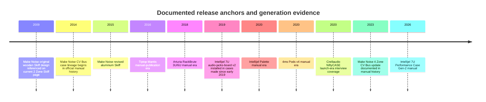
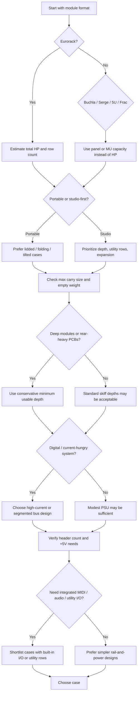

# Modular Synthesizer Cases for PatchHive

## Executive summary

This research set covers **50 modular-synth cases and cabinets** across Eurorack, Buchla 200e/200h, Serge 4U, 5U MU, and Frac, with a deliberate mix of mainstream current-production models, notable boutique options, and still-relevant legacy or kit-based formats. The present market is overwhelmingly **Eurorack-centric**, with dense current offerings from Intellijel, Doepfer, 4ms, ALM, Erica Synths, Make Noise, Tiptop Audio, Arturia, Pittsburgh Modular, Behringer, and Cre8audio, while current **5U**, **Buchla**, **Serge**, and especially **Frac** options are materially thinner and more concentrated among a few vendors. citeturn43search4turn2search1turn41search4turn9search10turn12search0turn31search11turn23search0turn29search0turn36search2

The most important technical finding is that **power and depth reporting are not standardized across manufacturers**. Some vendors publish full rail-current tables and header counts, while others publish only wattage, only external brick specs, or no current figures at all. Depth is likewise inconsistent: some makers publish minimum usable depth above the PSU, some publish only maximum internal depth, and some retailers publish more conservative or more practical fit figures than official pages. Three concrete examples illustrate the problem: **Arturia’s RackBrute manual contains an internal inconsistency** between its narrative power description and its electrical-spec table; **4ms lists Pod20 depth as 33 mm on official pages while a retailer lists 31.75 mm**; and **Behringer Eurorack Go is listed at 44 mm rear depth by a retailer while a review/Q&A thread on the same retailer site discusses ~52 mm at deeper points**. In the tables below, I used the most conservative directly documented figure where possible and marked unresolved fields as **unspecified**. citeturn21view0turn41search1turn41search17turn22search3turn45search7

For **portable performance systems**, the strongest officially documented high-current options in this sample are **Intellijel 7U Performance Case Gen‑2** at **+12V 6A / -12V 5A / +5V 2A**, **Make Noise 7U 4 Zone CV Bus Case** at **+12V 4A / -12V 2.4A / +5V 1A** with zone isolation, **Pittsburgh Structure EP‑208** at **+12V 5A / -12V 5A / +5V 2A**, and **Tiptop Mantis** at **+12V 3A / -12V 1.1A / +5V 0.3A**. For small desktop systems, the market clusters around **Intellijel Palette**, **4ms Pods**, **ALM skiffs**, **NiftyCASE**, and the newer **Make Noise 2 Zone Skiff**. citeturn11search6turn14view1turn12search5turn13search9turn43search6turn41search4turn9search10turn44search0turn38view0

Two ingestion-ready CSVs were created alongside this report: [master case dataset](sandbox:/mnt/data/patchhive_modular_cases_master.csv) and [power-only dataset](sandbox:/mnt/data/patchhive_modular_cases_power.csv).

## Scope and method

I prioritized **official manufacturer product pages and manuals** for widths, power rails, header counts, enclosure depth, supplied accessories, and official pricing. I then used **reputable retailers** such as Sweetwater and Perfect Circuit for complementary fields manufacturers often omit, especially **weight**, **outer dimensions**, and sometimes **practical module-depth fit**. Finally, where official and retailer data disagreed, I checked community-facing sources only to flag or contextualize discrepancies rather than to replace official numbers. That is why forum and user-content evidence appears mainly in notes about ambiguous depth or usability, not as the primary spec source. citeturn43search7turn13search11turn20view0turn22search1turn22search6turn22search15turn41search17turn45search7turn44search1

Normalization rules used for PatchHive are conservative. **Eurorack width** is recorded in **HP**. **5U MU** cabinets are recorded in **MU spaces**. **Buchla** is recorded in **panel/boat capacity**. **Serge** is recorded by **panel/module-boat capacity**. **Internal usable depth** is the *minimum explicitly usable* depth where manufacturers distinguish between “case depth” and “module clearance above PSU/bus,” and otherwise the field repeats the published internal/module depth. If a figure was not explicitly published in captured sources, it is marked **unspecified** rather than inferred. citeturn23search5turn29search0turn33search0turn43search18

Release year is the least stable field in this category because many current product pages do not preserve launch dates. I filled it only when I found a clear date anchor such as a dated manual, an official launch-era page, or a current page with version evidence. Otherwise it is marked **unspecified**. citeturn43search7turn11search7turn41search12turn44search8turn20view0

## Market structure and key findings

The current case landscape falls into four practical clusters. The first is the **small desktop/skiff tier**: Intellijel Palette, 4ms Pods, ALM cases, Make Noise 2 Zone Skiff, and NiftyCASE. These emphasize compact footprints, shallow profiles, and either modest integrated supplies or highly constrained external-brick topologies. This is the tier where module-depth conflicts and power-budget mistakes are most common, particularly with deep digital modules or right-angle ribbon strain. citeturn43search6turn41search4turn9search10turn38view0turn44search0

The second is the **portable performance tier**: Intellijel 7U, Make Noise 7U, Tiptop Mantis, Erica travel cases, RackBrute, and Pittsburgh EP‑208. These cases increasingly add **close‑patched lids**, **tilt/stand geometries**, **rear I/O**, and **segmented or high-current power distribution**, reflecting the fact that live systems now carry more digital modules, more audio interfaces, and more utility rows than earlier generations of skiffs and boats. citeturn11search6turn14view1turn13search9turn8search3turn19search1turn12search5

The third is the **large studio tier**: Doepfer Monster Base and Monster Case, Pittsburgh Structure 270 and Core 420, large Buchla cabinets, and large 5U studio cabinets. In this tier, power and ergonomics matter more than airline portability. Angled lower rows, deep module clearance, and multi-row distribution dominate. citeturn4view1turn11search0turn12search11turn23search3turn32search2

The fourth is the **format-specific legacy or specialist tier**: Buchla boats/cabinets, Random*Source Serge boats, Synthesizers.com MU cabinets, and Blacet’s Frac Rak-3. Here, **width is not HP**, power is often **format-proprietary or semi-proprietary**, and current production breadth is much narrower. This is important for PatchHive because a format-agnostic schema must not force HP onto panel-based ecosystems. citeturn23search5turn29search0turn33search0turn36search2

A recurring discrepancy pattern is also worth preserving in structured notes. **Arturia’s manual** describes one current limit in prose and another in its electrical-spec table; **4ms** rounds Pod depth to 33 mm while some retailers convert it back to 31.75 mm; and **Behringer GO** appears to have at least two practically relevant depth zones even when the conservative published rear-section value is smaller. For database purposes, this argues for separate fields for **depth_min_mm**, **depth_max_mm**, and **depth_notes** instead of a single depth cell. citeturn21view0turn41search1turn41search17turn22search3turn45search7

## Master specification table

The table below is compact enough to read in-report while still carrying the requested data. The downloadable master CSV contains the same rows in a cleaner ingestion format.

| Manufacturer       | Model                                 | Format(s)                | Size and depth                                                                                                                                                                     | Power and bus                                                                                                                                                                        | Mounting                              | Build, price, year                                                                                                                                       | Sources                                                        |
|:-------------------|:--------------------------------------|:-------------------------|:-----------------------------------------------------------------------------------------------------------------------------------------------------------------------------------|:-------------------------------------------------------------------------------------------------------------------------------------------------------------------------------------|:--------------------------------------|:---------------------------------------------------------------------------------------------------------------------------------------------------------|:---------------------------------------------------------------|
| Intellijel         | 4U Palette 62HP                       | Eurorack + Intellijel 1U | 62HP 3U + 62HP 1U; depth unspecified; usable unspecified; dims unspecified                                                                                                         | 40W PSU; +12 1.2A, -12 1.2A, +5 0.5A; powers ~12 modules; 2.1×5.5mm barrel AC/DC brick; integrated case bus; threaded M3 strips                                                   | Desktop skiff                         | unspecified; aluminum; silver or stealth; $299 official / street unspecified; 2020                                                                      | citeturn43search6turn11search2turn11search7               |
| Intellijel         | 4U Palette 104HP                      | Eurorack + Intellijel 1U | 104HP 3U + 104HP 1U; depth 45.5mm, 37.4mm at edge; usable 45.5mm max; dims unspecified                                                                                            | 60W PSU; +12 1.5A, -12 1.5A, +5 0.5A; up to 24 modules; 2.1×5.5mm barrel AC/DC brick; integrated case bus; threaded M3 strips                                                      | Desktop skiff                         | unspecified; aluminum; silver or stealth; $399 official / street unspecified; 2020                                                                      | citeturn43search6turn22search6turn11search7               |
| Intellijel         | 7U Performance Case Gen-2 104HP       | Eurorack + Intellijel 1U | 2×104HP 3U + 104HP 1U; depth 73mm, 50–62mm above PSU, 43–62mm above audio/MIDI boards; usable 43mm minimum stated zone; dims 556.5×352.9×146.4mm w/lid, 556.5×352.4×79.6mm w/o lid | TPS135W MAX; +12 6A, -12 5A, +5 2A; 34 headers; 2.5×5.5mm barrel via 90W brick; integrated TPS135W MAX bus                                                                          | Portable case with lid                | 4.74kg w/lid; solid aluminum frame; $749 official / street unspecified; 2026                                                                            | citeturn11search6turn43search12turn43search7              |
| Make Noise         | 2 Zone Skiff                          | Eurorack                 | 104HP 3U; depth 2" over bus board, 2.5" otherwise; usable 2" over bus board; dims 21.5×5.14×2.75in                                                                              | +12 2A, -12 1.2A, +5 1A; 16 shrouded headers; universal AC adapter; 2-Zone Bus Board                                                                                                | Powered skiff                         | 4.55lb; black powder-coated aluminum; $349 official / street $349; unspecified                                                                          | citeturn38view0turn22search8                               |
| Make Noise         | Skiff No Power                        | Eurorack                 | 104HP 3U; depth 2.56in internal; usable 2.56in; dims 21.5×5.14×2.75in                                                                                                             | None; none                                                                                                                                                                            | Unpowered skiff                       | 4.25lb; black powder-coated aluminum; $99 official / street unspecified; unspecified                                                                    | citeturn38view1                                             |
| Make Noise         | 7U 4 Zone CV Bus Case                 | Eurorack                 | 2×104HP 3U + 104HP utility row; depth 2.5in; usable unspecified; dims 22.25×14×7.25in                                                                                             | 4-Zone board; overall +12 4A, -12 2.4A, +5 1A; each zone +12 1A, -12 0.6A; locking 4-pin DIN PSU input; 4 Zone Power Bus + CV Bus                                                   | Portable case with removable lid      | 12.75lb; powder-coated metal, matte black; $799 official / street $799; 2023                                                                            | citeturn14view1turn15view1turn22search10turn13search10   |
| Tiptop Audio       | Mantis                                | Eurorack                 | 2×104HP; depth 50mm / 61mm max by zone; usable 50mm minimum zone; dims 540×314×73/107mm depending position                                                                       | Zeus DC4000; +12 3A split across 3 zones, -12 1.1A, +5 0.3A; 36 keyed connectors; 13VDC input; Zeus Powered Mantis series                                                           | Desktop / portable with folding stand | 3kg; injection-molded chassis with Z-Rails; multiple leg colors / wood edition; $335 street; $399 special edition wood; 2016                            | citeturn13search9turn40search7turn13search11              |
| Tiptop Audio       | Happy Ending Kit                      | Eurorack                 | 84HP 3U; depth 4in; usable 4in; dims 18.9×5.19×4in                                                                                                                                | microZEUS 4HP PSU with flying bus boards; 1000mA Ault adapter included; flying bus board ribbons                                                                                     | Rack ears / rackmount kit             | 1.76lb; rails + ears, black or silver; $129 street; unspecified                                                                                         | citeturn22search4                                           |
| Doepfer            | A-100LC1                              | Eurorack                 | 48HP 3U; depth 80mm; usable 80mm; dims unspecified                                                                                                                                | PSU3/PSU3A or PSU2 depending build; common ratings +12 2A, -12 1.2A, +5 4A (PSU3) or +12 1.2A, -12 1.2A, +5 4A (PSU2); Doepfer bus board                                            | Desktop/raw wood                      | unspecified; raw wood cabinet; price unspecified; unspecified                                                                                            | citeturn2search1turn4view0                                 |
| Doepfer            | A-100LC3                              | Eurorack                 | 84HP 3U; depth 110mm; usable 110mm; dims 17.51×5.90×6.29in                                                                                                                        | PSU3/PSU3A or PSU2; see manufacturer PSU ratings; Doepfer bus board                                                                                                                 | Desktop/raw wood                      | 5.51lb; raw wood cabinet; street $250; MSRP unspecified; unspecified                                                                                    | citeturn22search12turn4view0                               |
| Doepfer            | A-100LC6                              | Eurorack                 | 84HP 6U; depth unspecified; usable unspecified; dims unspecified                                                                                                                  | PSU3 or PSU2 depending version; common ratings +12 2A, -12 1.2A, +5 4A (PSU3); Doepfer bus board                                                                                    | Desktop/raw wood                      | unspecified; raw wood cabinet; price unspecified; unspecified                                                                                            | citeturn2search1turn4view0                                 |
| Doepfer            | A-100P6                               | Eurorack                 | 84HP 6U; depth unspecified; usable unspecified; dims unspecified                                                                                                                  | PSU3; +12 2A, -12 1.2A, +5 4A; Doepfer bus board                                                                                                                                    | Portable suitcase                     | unspecified; flight-case style portable cabinet; price unspecified; unspecified                                                                         | citeturn2search3turn4view0                                 |
| Doepfer            | A-100P9                               | Eurorack                 | 84HP 9U; depth unspecified; usable unspecified; dims unspecified                                                                                                                  | PSU3; +12 2A, -12 1.2A, +5 4A; Doepfer bus board                                                                                                                                    | Portable suitcase                     | unspecified; flight-case style portable cabinet; price unspecified; unspecified                                                                         | citeturn2search3turn4view0                                 |
| Doepfer            | Monster Base                          | Eurorack                 | 168HP base format; depth 120mm top / 160mm bottom; usable 120mm minimum; dims unspecified                                                                                         | PSU3 with 3 bus boards; +12 2A, -12 1.2A, +5 4A; Doepfer bus boards                                                                                                                 | Angled base case                      | unspecified; wood cabinet; price unspecified; unspecified                                                                                                | citeturn2search3turn4view1                                 |
| Doepfer            | Monster Case                          | Eurorack                 | 3×168HP; depth 70mm upper row / 100mm lower rows; usable 70mm minimum; dims unspecified                                                                                           | PSU3 with 3 bus boards; +12 2A, -12 1.2A, +5 4A; Doepfer bus boards                                                                                                                 | Large studio cabinet                  | unspecified; wood cabinet; price unspecified; unspecified                                                                                                | citeturn2search3turn4view1                                 |
| Doepfer            | A-100DIY1 Kit                         | Eurorack                 | 84HP-ready DIY power kit; depth n/a; usable n/a; dims n/a                                                                                                                         | PSU3; +12 2A, -12 1.2A, +5 4A; 3 bus boards; DIY mains wiring; 3 A-100 bus boards                                                                                                   | DIY rack/case power kit               | n/a; DIY PSU + busboard kit; price unspecified; unspecified                                                                                             | citeturn4view1                                              |
| 4ms                | Pod20 Powered                         | Eurorack                 | 20HP 3U; depth 33mm; usable 33mm; dims unspecified                                                                                                                                | Integrated Pod power; requires external 15–24VDC center-positive 2.1mm barrel brick; rail current unspecified; 2 headers; integrated powered bus; keyed Eurorack headers            | Powered desktop pod                   | unspecified; 100% anodized aluminum; $99 official; 2020                                                                                                 | citeturn41search1turn41search12turn41search8              |
| 4ms                | Pod32 Powered                         | Eurorack                 | 32HP 3U; depth 33mm; usable 33mm; dims 167.1×159.5×36mm                                                                                                                           | Integrated Pod power; requires external 15–24VDC center-positive 2.1mm barrel brick; rail current unspecified; 2 headers; integrated powered bus; keyed Eurorack headers            | Powered desktop pod                   | unspecified; 100% anodized aluminum; $119 official; 2020                                                                                                | citeturn42search0turn42search4turn41search12              |
| 4ms                | Pod34X Powered                        | Eurorack                 | 34HP 3U; depth 51mm; usable 51mm; dims unspecified                                                                                                                                | Integrated Pod power; requires external 15–24VDC center-positive 2.1mm barrel brick; rail current unspecified; 4 headers; integrated powered bus; keyed Eurorack headers            | Powered desktop pod                   | unspecified; 100% anodized aluminum; price unspecified; 2020                                                                                            | citeturn42search1turn42search11                            |
| 4ms                | Pod40X Powered                        | Eurorack                 | 40HP 3U; depth 51mm; usable 51mm; dims unspecified                                                                                                                                | Integrated Pod power; requires external 15–24VDC center-positive 2.1mm barrel brick; rail current unspecified; 4 headers; integrated powered bus; keyed Eurorack headers            | Powered desktop pod                   | unspecified; 100% anodized aluminum; $145 official; 2020                                                                                                | citeturn42search3turn42search11                            |
| 4ms                | Pod48X Powered                        | Eurorack                 | 48HP 3U; depth 51mm; usable 51mm; dims unspecified                                                                                                                                | Integrated Pod power; requires external 15–24VDC center-positive 2.1mm barrel brick; rail current unspecified; 4 headers; integrated powered bus; keyed Eurorack headers            | Powered desktop pod                   | unspecified; 100% anodized aluminum; $155 official; 2020                                                                                                | citeturn41search15turn42search11                           |
| 4ms                | Pod64X Powered                        | Eurorack                 | 64HP 3U; depth 55mm; usable 55mm; dims unspecified                                                                                                                                | Integrated Pod power; requires external 15–24VDC center-positive 2.1mm barrel brick; rail current unspecified; 8 headers; integrated powered bus; keyed Eurorack headers            | Powered desktop pod                   | unspecified; 100% anodized aluminum; $195 official; 2020                                                                                                | citeturn41search3turn41search12                            |
| ALM Busy Circuits  | 52HP 3U Case                          | Eurorack                 | 52HP 3U; depth 42mm; usable 42mm; dims 277×132×66mm                                                                                                                               | Shielded DC/DC converter; no +5V rail; overload/short-circuit protection; center-positive 2.1mm barrel brick; +12 1A, -12 1A; 9 connectors; fixed solid bus board                   | Powered desktop skiff                 | 0.7kg; lightweight anodized aluminum; £220 official; unspecified                                                                                        | citeturn9search0turn9search9                               |
| ALM Busy Circuits  | 84HP 3U Case                          | Eurorack                 | 84HP 3U; depth 42mm; usable 42mm; dims 440×132×66mm                                                                                                                               | Shielded DC/DC converter; no +5V rail; overload/short-circuit protection; center-positive 2.1mm barrel brick; +12 1A, -12 1A; 16 connectors; fixed solid bus board                  | Powered desktop skiff                 | 0.9kg; lightweight anodized aluminum; £250 official; unspecified                                                                                        | citeturn9search7turn9search9                               |
| ALM Busy Circuits  | 52HP 6U Case                          | Eurorack                 | 52HP 6U; depth 42mm lower / 54mm upper; usable 42mm minimum; dims 277×264×66mm                                                                                                    | Shielded DC/DC converter; no +5V rail; overload/short-circuit protection; center-positive 2.1mm barrel brick; +12 1A, -12 1A; 9 on busboard + 6 flying; fixed bus board + flying bus | Powered desktop                       | 1.4kg; lightweight anodized aluminum; £340 official; unspecified                                                                                        | citeturn9search1turn9search9                               |
| Erica Synths       | 2×104HP Carbon Fiber Travel Case 2    | Eurorack                 | 104HP 6U; depth unspecified; usable unspecified; dims 22.44×11.02×5.51in                                                                                                          | Integrated powered travel case; rail currents unspecified; integrated powered rails                                                                                                 | Portable travel case with lid         | 3.1kg / 7.05lb empty; carbon fiber; industrial orangeskin texture paint; price unspecified officially / street listed by retailer; unspecified         | citeturn8search3turn8search8turn22search15                |
| Erica Synths       | 2×104HP Aluminum Travel Case with Lid | Eurorack                 | 104HP 6U; depth unspecified; usable unspecified; dims unspecified                                                                                                                 | Integrated powered travel case; rail currents unspecified; integrated powered rails                                                                                                 | Portable travel case with lid         | unspecified; all aluminum; €550 official; unspecified                                                                                                   | citeturn8search14                                           |
| Arturia            | RackBrute 3U                          | Eurorack                 | 88HP 3U; depth unspecified; usable unspecified; dims unspecified                                                                                                                  | 15V 3000mA external PSU; RackBrute electrical spec +12 1600mA, -12 800mA, +5 500mA; 20 sockets; Doepfer-compatible bus board                                                        | Boat / linkable / folding             | unspecified; metal frame, noir finish; €259 official / street varies; 2018                                                                              | citeturn19search4turn20view0turn21view0                   |
| Arturia            | RackBrute 6U                          | Eurorack                 | 176HP 6U; depth 56mm upper / 75mm lower; usable 56mm minimum; dims 19×13.2×3.3in                                                                                                 | 15V 3000mA external PSU; RackBrute electrical spec +12 1600mA, -12 800mA, +5 500mA; 20+12 sockets; Doepfer-compatible bus board                                                     | Boat / linkable / folding             | 8.3lb; metal frame, noir finish; €359 official / street $359; 2018                                                                                      | citeturn19search1turn21view0turn22search1                 |
| Pittsburgh Modular | Structure EP-208                      | Eurorack                 | 208HP (2×104HP); depth unspecified; usable unspecified; dims unspecified                                                                                                          | +12 5A, -12 5A, +5 2A; integrated heavy-duty power                                                                                                                                  | Road/flight case with detachable lid  | unspecified; road case construction; price unspecified; unspecified                                                                                     | citeturn12search5turn12search1                             |
| Pittsburgh Modular | Structure 270                         | Eurorack                 | 270HP; depth 3 3/8in minimum / 6in max; usable 3 3/8in; dims 19×18×3.5–9in                                                                                                        | +12 5A; other rails unspecified; integrated power                                                                                                                                    | Desktop/studio angled                 | 14lb; wood/metal structure; price unspecified; unspecified                                                                                              | citeturn11search0                                           |
| Pittsburgh Modular | Structure Core 420                    | Eurorack                 | 420HP; depth 35–74mm; usable 35mm; dims 29×16.5×3.5in                                                                                                                             | power unspecified on captured snippet; integrated power                                                                                                                              | Studio case                           | 15lb 4oz; wood/metal structure; price unspecified; unspecified                                                                                          | citeturn12search11                                          |
| Pittsburgh Modular | Lifeforms Research Console            | Eurorack                 | 96HP (2×48HP); depth 65mm top / 49mm bottom; usable 49mm; dims 10.9×9.5×unspecifiedin                                                                                             | power unspecified on captured snippet; integrated power                                                                                                                              | Desktop console                       | 5.3lb / 2.5kg; steel construction; price unspecified; unspecified                                                                                       | citeturn12search14                                          |
| Pittsburgh Modular | Cell[90] DC                           | Eurorack                 | 90HP 3U; depth 52mm, 36mm above PSU; usable 36mm; dims unspecified                                                                                                                | 15VDC 2.6A adapter; +5V rail included; Eurorack-bus compatible; exact rail currents unspecified; single-row bus (DC case family)                                                    | Desktop skiff                         | unspecified; 16-gauge steel with hardwood sides; $349 suggested retail; unspecified                                                                     | citeturn12search16                                          |
| Cre8audio          | NiftyCASE                             | Eurorack                 | 84HP 3U; depth unspecified; usable unspecified; dims unspecified                                                                                                                  | Built-in powered case; 9 power outlets on cable per user/manual discussion; exact rail currents unspecified; USB + 5-pin MIDI to CV/Gate/Clock/Mod; integrated cable harness        | Desktop portable                      | 3.96lb; metal chassis with real wood endcaps; street $199.99; official price unspecified on current capture; 2020                                       | citeturn44search0turn22search5turn44search1turn44search8 |
| Behringer          | Eurorack Go                           | Eurorack                 | 280HP (2×140HP); depth 44–52mm reported; usable 44mm rear section, ~52mm at deeper area; dims 28.5×12.2×4.4in                                                                    | Low-noise PSU; 32 keyed power connectors; rail-current figures not exposed in captured official snippet; integrated keyed bus                                                       | Portable desktop with adjustable legs | 8.6lb; utility case with adjustable aluminum legs; $219 street; unspecified                                                                             | citeturn22search3turn45search1turn45search7turn45search5 |
| Buchla             | 201e-4 Powered Boat                   | Buchla 200e/200h         | 4 Buchla panels; depth unspecified; usable unspecified; dims unspecified                                                                                                          | Powered boat with internal power distribution; current unspecified; integrated Buchla power distribution                                                                            | Boat                                  | unspecified; aluminum boat; $649 official; unspecified                                                                                                  | citeturn27search2turn23search5                             |
| Buchla             | 201e-6 Powered Boat                   | Buchla 200e/200h         | 6 Buchla panels; depth unspecified; usable unspecified; dims unspecified                                                                                                          | Powered boat with internal power distribution; current unspecified; integrated Buchla power distribution                                                                            | Boat                                  | unspecified; aluminum boat; $699 official; unspecified                                                                                                  | citeturn26search3turn23search5                             |
| Buchla             | 201e-10 Powered Cabinet               | Buchla 200e/200h         | 10 Buchla panels; depth unspecified; usable unspecified; dims 24×14×10in folded                                                                                                   | Powered cabinet; current unspecified; integrated Buchla power distribution                                                                                                          | Portable folding cabinet              | unspecified; cabinet, folding design; $1,299 official; unspecified                                                                                      | citeturn26search2turn23search0                             |
| Buchla             | 201e-12 Powered Cabinet               | Buchla 200e/200h         | 12 Buchla panels; depth unspecified; usable unspecified; dims 18.5in wide; carrying case 22×17×11in                                                                              | Powered cabinet; current unspecified; integrated Buchla power distribution                                                                                                          | Cabinet                               | unspecified; three-boat cabinet; $1,599 official; unspecified                                                                                           | citeturn27search0turn23search0                             |
| Buchla             | 201e-18 Powered Cabinet               | Buchla 200e/200h         | 18 Buchla panels; depth unspecified; usable unspecified; dims unspecified                                                                                                         | Powered cabinet; current unspecified; integrated Buchla power distribution                                                                                                          | Cabinet                               | unspecified; three six-panel aluminum boats with hardwood trim; $2,149 official; unspecified                                                            | citeturn26search0turn23search0                             |
| Buchla             | 201e-24 Powered Cabinet               | Buchla 200e/200h         | 24 Buchla panels; depth unspecified; usable unspecified; dims 31×24×13in                                                                                                          | Powered cabinet; current unspecified; integrated Buchla power distribution                                                                                                          | Cabinet                               | unspecified; four six-panel boats / cabinet; $2,649 official; unspecified                                                                               | citeturn23search3turn23search0                             |
| Buchla             | Skylab                                | Buchla 200e              | 10 modules / portable system case; depth unspecified; usable unspecified; dims unspecified                                                                                        | Portable powered system; current unspecified; integrated Buchla power distribution                                                                                                  | Folding portable cabinet              | unspecified; portable system enclosure; bundle/system pricing varies; unspecified                                                                       | citeturn23search4turn26search6                             |
| Random*Source      | RS4 Boat Shallow                      | Serge 4U                 | 1 full panel or 4×4 modules; depth 66mm; usable 64mm; dims unspecified                                                                                                            | None; passive boat with cutout for Serge/XLR power; PSD-compatible passive distribution option                                                                                      | Boat / rack-ear ready                 | unspecified; specially treated aluminum, stainless-like look; €200 boat / €240 with rack ears; unspecified                                              | citeturn29search0                                           |
| Random*Source      | RS4P Powered Shallow Boat             | Serge 4U                 | 1 full panel or 1–2 boats powered; depth 66mm; usable 64mm less PSU intrusion; dims unspecified                                                                                   | Internal mobile PSU; 1000mA per rail; external laptop-style converter; internal PSU + distribution                                                                                  | Powered boat                          | unspecified; aluminum boat with internal PSU; €500 official; unspecified                                                                                | citeturn29search0                                           |
| Random*Source      | RS6 Boat XL Shallow                   | Serge 4U                 | 1.5× width; 6 Random*Source 4×4 modules; depth 66mm; usable 64mm; dims unspecified                                                                                                | None; passive boat; PSD-compatible passive distribution option                                                                                                                      | XL boat                               | unspecified; specially treated aluminum; €248 official; unspecified                                                                                     | citeturn29search0                                           |
| Synthesizers.com   | QCP22 Portable Cabinet                | 5U MU                    | 22 MU (2×11); depth ample for QPS1; usable ample for QPS1; dims unspecified                                                                                                       | Supports QPS1 and QDH harness; dotcom rails +15V/-15V/+5V; QDH harness supported                                                                                                    | Portable cabinet                      | unspecified; portable cabinet; $410 official; unspecified                                                                                               | citeturn31search6turn33search3turn33search1turn33search0 |
| Synthesizers.com   | QCS44 Studio Cabinet                  | 5U MU                    | 44 MU front (2×22) + 4 rear spaces; depth unspecified; usable unspecified; dims unspecified                                                                                       | Supports dotcom power ecosystem; +15V/-15V/+5V standard; QDH/QPS compatible                                                                                                         | Studio cabinet                        | unspecified; walnut studio cabinet; $1,295 official; unspecified                                                                                        | citeturn32search2turn33search1turn33search0               |
| Synthesizers.com   | QCF22 Folding Cabinet                 | 5U MU                    | 22 MU folding cabinet; depth unspecified; usable unspecified; dims unspecified                                                                                                    | Supports dotcom power ecosystem; +15V/-15V/+5V standard; QDH/QPS compatible                                                                                                         | Folding patch-and-go cabinet          | unspecified; folding cabinet; $848 official; unspecified                                                                                                | citeturn32search1turn33search1turn33search0               |
| Blacet Research    | Rak-3 Powered Case                    | Frac                     | 20 Frac widths in 6U (2 rows); depth unspecified; usable unspecified; dims unspecified                                                                                            | +/-15V @ 800mA; Frac distribution buss                                                                                                                                              | Powered rack case                     | unspecified; metal rack enclosure; $289 full kit / lower kit prices available; 2024 refresh                                                             | citeturn36search2                                           |

## Power specification table

This companion table isolates power topology and bus details for ingestion into a separate `case_power` table.

| Manufacturer       | Model                                 | Power                                                                                                                                                  | Bus board                                      | Sources                                                        |
|:-------------------|:--------------------------------------|:-------------------------------------------------------------------------------------------------------------------------------------------------------|:-----------------------------------------------|:---------------------------------------------------------------|
| Intellijel         | 4U Palette 62HP                       | 40W PSU; +12 1.2A, -12 1.2A, +5 0.5A; powers ~12 modules; 2.1×5.5mm barrel AC/DC brick                                                                | Integrated case bus; threaded M3 strips        | citeturn43search6turn11search2turn11search7               |
| Intellijel         | 4U Palette 104HP                      | 60W PSU; +12 1.5A, -12 1.5A, +5 0.5A; up to 24 modules; 2.1×5.5mm barrel AC/DC brick                                                                  | Integrated case bus; threaded M3 strips        | citeturn43search6turn22search6turn11search7               |
| Intellijel         | 7U Performance Case Gen-2 104HP       | TPS135W MAX; +12 6A, -12 5A, +5 2A; 34 headers; 2.5×5.5mm barrel via 90W brick                                                                        | Integrated TPS135W MAX bus                     | citeturn11search6turn43search12turn43search7              |
| Make Noise         | 2 Zone Skiff                          | +12 2A, -12 1.2A, +5 1A; 16 shrouded headers; universal AC adapter                                                                                    | 2-Zone Bus Board                               | citeturn38view0turn22search8                               |
| Make Noise         | 7U 4 Zone CV Bus Case                 | 4-Zone board; overall +12 4A, -12 2.4A, +5 1A; each zone +12 1A, -12 0.6A; locking 4-pin DIN PSU input                                                | 4 Zone Power Bus + CV Bus                      | citeturn14view1turn15view1turn22search10turn13search10   |
| Tiptop Audio       | Mantis                                | Zeus DC4000; +12 3A split across 3 zones, -12 1.1A, +5 0.3A; 36 keyed connectors; 13VDC input                                                         | Zeus Powered Mantis series                     | citeturn13search9turn40search7turn13search11              |
| Tiptop Audio       | Happy Ending Kit                      | microZEUS 4HP PSU with flying bus boards; 1000mA Ault adapter included                                                                                | Flying bus board ribbons                       | citeturn22search4                                           |
| Doepfer            | A-100LC1                              | PSU3/PSU3A or PSU2 depending build; common ratings +12 2A, -12 1.2A, +5 4A (PSU3) or +12 1.2A, -12 1.2A, +5 4A (PSU2)                                 | Doepfer bus board                              | citeturn2search1turn4view0                                 |
| Doepfer            | A-100LC3                              | PSU3/PSU3A or PSU2; see manufacturer PSU ratings                                                                                                      | Doepfer bus board                              | citeturn22search12turn4view0                               |
| Doepfer            | A-100LC6                              | PSU3 or PSU2 depending version; common ratings +12 2A, -12 1.2A, +5 4A (PSU3)                                                                         | Doepfer bus board                              | citeturn2search1turn4view0                                 |
| Doepfer            | A-100P6                               | PSU3; +12 2A, -12 1.2A, +5 4A                                                                                                                         | Doepfer bus board                              | citeturn2search3turn4view0                                 |
| Doepfer            | A-100P9                               | PSU3; +12 2A, -12 1.2A, +5 4A                                                                                                                         | Doepfer bus board                              | citeturn2search3turn4view0                                 |
| Doepfer            | Monster Base                          | PSU3 with 3 bus boards; +12 2A, -12 1.2A, +5 4A                                                                                                      | Doepfer bus boards                             | citeturn2search3turn4view1                                 |
| Doepfer            | Monster Case                          | PSU3 with 3 bus boards; +12 2A, -12 1.2A, +5 4A                                                                                                      | Doepfer bus boards                             | citeturn2search3turn4view1                                 |
| Doepfer            | A-100DIY1 Kit                         | PSU3; +12 2A, -12 1.2A, +5 4A; 3 bus boards; DIY mains wiring                                                                                         | 3 A-100 bus boards                             | citeturn4view1                                              |
| 4ms                | Pod20 Powered                         | Integrated Pod power; requires external 15–24VDC center-positive 2.1mm barrel brick; rail current unspecified; 2 headers                              | Integrated powered bus; keyed Eurorack headers | citeturn41search1turn41search12turn41search8              |
| 4ms                | Pod32 Powered                         | Integrated Pod power; requires external 15–24VDC center-positive 2.1mm barrel brick; rail current unspecified; 2 headers                              | Integrated powered bus; keyed Eurorack headers | citeturn42search0turn42search4turn41search12              |
| 4ms                | Pod34X Powered                        | Integrated Pod power; requires external 15–24VDC center-positive 2.1mm barrel brick; rail current unspecified; 4 headers                              | Integrated powered bus; keyed Eurorack headers | citeturn42search1turn42search11                            |
| 4ms                | Pod40X Powered                        | Integrated Pod power; requires external 15–24VDC center-positive 2.1mm barrel brick; rail current unspecified; 4 headers                              | Integrated powered bus; keyed Eurorack headers | citeturn42search3turn42search11                            |
| 4ms                | Pod48X Powered                        | Integrated Pod power; requires external 15–24VDC center-positive 2.1mm barrel brick; rail current unspecified; 4 headers                              | Integrated powered bus; keyed Eurorack headers | citeturn41search15turn42search11                           |
| 4ms                | Pod64X Powered                        | Integrated Pod power; requires external 15–24VDC center-positive 2.1mm barrel brick; rail current unspecified; 8 headers                              | Integrated powered bus; keyed Eurorack headers | citeturn41search3turn41search12                            |
| ALM Busy Circuits  | 52HP 3U Case                          | Shielded DC/DC converter; no +5V rail; overload/short-circuit protection; center-positive 2.1mm barrel brick; +12 1A, -12 1A; 9 connectors            | Fixed solid bus board                          | citeturn9search0turn9search9                               |
| ALM Busy Circuits  | 84HP 3U Case                          | Shielded DC/DC converter; no +5V rail; overload/short-circuit protection; center-positive 2.1mm barrel brick; +12 1A, -12 1A; 16 connectors           | Fixed solid bus board                          | citeturn9search7turn9search9                               |
| ALM Busy Circuits  | 52HP 6U Case                          | Shielded DC/DC converter; no +5V rail; overload/short-circuit protection; center-positive 2.1mm barrel brick; +12 1A, -12 1A; 9 on busboard + 6 flying | Fixed bus board + flying bus                   | citeturn9search1turn9search9                               |
| Erica Synths       | 2×104HP Carbon Fiber Travel Case 2    | Integrated powered travel case; rail currents unspecified                                                                                             | Integrated powered rails                       | citeturn8search3turn8search8turn22search15                |
| Erica Synths       | 2×104HP Aluminum Travel Case with Lid | Integrated powered travel case; rail currents unspecified                                                                                             | Integrated powered rails                       | citeturn8search14                                           |
| Arturia            | RackBrute 3U                          | 15V 3000mA external PSU; RackBrute electrical spec +12 1600mA, -12 800mA, +5 500mA; 20 sockets                                                        | Doepfer-compatible bus board                   | citeturn19search4turn20view0turn21view0                   |
| Arturia            | RackBrute 6U                          | 15V 3000mA external PSU; RackBrute electrical spec +12 1600mA, -12 800mA, +5 500mA; 20+12 sockets                                                     | Doepfer-compatible bus board                   | citeturn19search1turn21view0turn22search1                 |
| Pittsburgh Modular | Structure EP-208                      | +12 5A, -12 5A, +5 2A                                                                                                                                 | Integrated heavy-duty power                    | citeturn12search5turn12search1                             |
| Pittsburgh Modular | Structure 270                         | +12 5A; other rails unspecified on snippet                                                                                                            | Integrated power                               | citeturn11search0                                           |
| Pittsburgh Modular | Structure Core 420                    | power unspecified on snippet                                                                                                                          | Integrated power                               | citeturn12search11                                          |
| Pittsburgh Modular | Lifeforms Research Console            | power unspecified on snippet                                                                                                                          | Integrated power                               | citeturn12search14                                          |
| Pittsburgh Modular | Cell[90] DC                           | 15VDC 2.6A adapter; +5V rail included; Eurorack-bus compatible; exact rail currents unspecified                                                       | Single-row bus                                 | citeturn12search16                                          |
| Cre8audio          | NiftyCASE                             | Built-in powered case; 9 power outlets on cable per user/manual discussion; exact rail currents unspecified; USB + 5-pin MIDI to CV/Gate/Clock/Mod    | Integrated cable harness                       | citeturn44search0turn22search5turn44search1turn44search8 |
| Behringer          | Eurorack Go                           | Low-noise PSU; 32 keyed power connectors; rail-current figures not exposed in captured official snippet                                               | Integrated keyed bus                           | citeturn22search3turn45search1turn45search7turn45search5 |
| Buchla             | 201e-4 Powered Boat                   | Powered boat with internal power distribution; current unspecified                                                                                    | Integrated Buchla power distribution           | citeturn27search2turn23search5                             |
| Buchla             | 201e-6 Powered Boat                   | Powered boat with internal power distribution; current unspecified                                                                                    | Integrated Buchla power distribution           | citeturn26search3turn23search5                             |
| Buchla             | 201e-10 Powered Cabinet               | Powered cabinet; current unspecified                                                                                                                  | Integrated Buchla power distribution           | citeturn26search2turn23search0                             |
| Buchla             | 201e-12 Powered Cabinet               | Powered cabinet; current unspecified                                                                                                                  | Integrated Buchla power distribution           | citeturn27search0turn23search0                             |
| Buchla             | 201e-18 Powered Cabinet               | Powered cabinet; current unspecified                                                                                                                  | Integrated Buchla power distribution           | citeturn26search0turn23search0                             |
| Buchla             | 201e-24 Powered Cabinet               | Powered cabinet; current unspecified                                                                                                                  | Integrated Buchla power distribution           | citeturn23search3turn23search0                             |
| Buchla             | Skylab                                | Portable powered system; current unspecified                                                                                                          | Integrated Buchla power distribution           | citeturn23search4turn26search6                             |
| Random*Source      | RS4P Powered Shallow Boat             | Internal mobile PSU; 1000mA per rail; external laptop-style converter                                                                                 | Internal PSU + distribution                    | citeturn29search0                                           |
| Blacet Research    | Rak-3 Powered Case                    | +/-15V @ 800mA                                                                                                                                        | Frac distribution buss                         | citeturn36search2                                           |

## Visual models

The timeline below includes only cases whose year could be anchored by an official manual, dated official page, or contemporaneous documentation trail. Many other entries remain **unspecified** because current product pages do not preserve launch dates. citeturn38view0turn13search10turn13search11turn20view0turn11search7turn41search12turn44search8turn43search7

The decision flow below reflects the strongest differentiators that emerged across the research set: **format lock-in, portability, power budget, depth, and mounting ergonomics**. Those five factors explain most case-selection failures in practice. citeturn23search5turn29search0turn33search0turn11search6turn14view1turn13search9turn41search4

## Database normalization notes

For PatchHive, the case data will be much more robust if the schema separates **physical enclosure data** from **power-distribution data** and from **source provenance**. The research above repeatedly shows that a single flat text field for “depth” or “power” loses important distinctions. In particular, the following three additions would reduce ambiguity materially:

A `physical_case` table should keep `format_family`, `width_value`, `width_unit`, `rows`, `depth_min_mm`, `depth_max_mm`, `depth_notes`, `outer_dimensions_mm`, `weight_kg`, `mounting_style`, `materials`, `finish`, `portable_lid`, and `tilt_or_stand`. That structure handles Eurorack, MU, Buchla panel counts, and Serge boats without forcing HP onto non-HP formats.

A `case_power` table should keep `supply_type`, `external_input_spec`, `rail_pos12_ma`, `rail_neg12_ma`, `rail_pos5_ma`, `other_rails`, `header_count`, `connector_type`, `bus_type`, `zoned_distribution`, and `power_notes`. This matters because the same case family can change PSU revisions over time, and because some products expose only external-brick wattage while others expose internal rail currents. The Arturia, 4ms, and Behringer records are direct examples of why this separation is useful. citeturn21view0turn41search12turn45search1

A `source_provenance` table should store `source_type` such as `official_product_page`, `official_manual`, `retailer_crosscheck`, or `forum_discrepancy_note`, plus `source_link`, `capture_date`, and `confidence_flag`. That makes it possible to preserve both the official spec and the reason a manual override or caution note exists for depth or power. citeturn43search7turn22search1turn41search17turn45search7

Overall, the safest practical rule for ingestion is simple: **store the conservative published fit number, preserve the conflicting number in notes, and never collapse bus topology into a single “current” integer**. That keeps PatchHive useful for both cataloging and actual build-planning. citeturn21view0turn41search1turn22search3turn45search7